

### Universidad Peruana de Ciencias Aplicadas  
### Ingeniería de Software  
### 2026-1  

### NRC: 11834  
### Docente: Ivan Robles Fernandez
### Informe de Trabajo Final  

### SoftTech  
### SafeHome  

| **Código** | **Integrante** |
|------------|----------------|
| U20241D932 | Briguite Eryka Carhuaz Centeno |
| U202319329 | Gonzalo Alexander Jaime Forcelledo |
| U201911393 | Mauricio Jared Padilla Merino |
| U202115654 | Luis Ángel Pililaca Vidal |
| U202411373 | Valeria Alexandra Rojas Gómez |

### Abril 2026

---

# Registro de Versiones del Informe

| Versión | Fecha | Autor | Descripción de modificación |
|---------|-------|-------|-----------------------------|
| 1.0 | 08/04/2026 | Grupo SoftTech | Se avanzaron los capítulos correspondientes al AV1 del proyecto SafeHome. |

---

# Project Report Collaboration Insights

**URL del Repositorio:** [SafeHome Project Report](https://github.com/upc-pre-2610-1ASI0729-11834-SoftTech/SafeHome-report)

El informe del proyecto SafeHome fue desarrollado de manera colaborativa por el equipo SoftTech mediante GitHub. Para organizar el trabajo, se utilizó una rama principal `main`, una rama de integración `develop` y ramas `feature/chapter-*` para distribuir el desarrollo del reporte por capítulos.

Cada integrante trabajó en la rama correspondiente a su capítulo o sección asignada, realizando commits con mensajes descriptivos bajo la convención de Conventional Commits. Esta organización permitió mantener la trazabilidad de los cambios, evidenciar la participación del equipo y facilitar la integración progresiva del informe.

---

# Student Outcome ABET 3

**Capacidad de comunicarse efectivamente con un rango de audiencias.**

| Criterio específico | Descripción | Acciones realizadas | Conclusiones |
|--------------------|-------------|---------------------|--------------|
| 3.c1. Comunica oralmente con efectividad a diferentes rangos de audiencia | El estudiante comunica resultados y proceso de ingeniería aplicado para el ciclo de desarrollo y despliegue de una solución web distribuida bajo una arquitectura orientada a servicios, con enfoque innovador e inclusivo. | AV1: El equipo explicó los avances del proyecto SafeHome, incluyendo la problemática, análisis de usuarios, diseño UX/UI, propuesta técnica e implementación inicial. | El equipo logró comunicar oralmente los principales resultados del avance, sustentando las decisiones tomadas en el diseño y desarrollo de la solución. |
| 3.c2. Comunica por escrito con efectividad a diferentes rangos de audiencia | El estudiante comunica por escrito los resultados y el proceso de ingeniería aplicado en el desarrollo de una solución web distribuida. | AV1: El equipo documentó el informe en formato Markdown, registrando evidencias, decisiones de diseño, requisitos, diagramas, arquitectura y avances de implementación. | La documentación permitió comunicar de manera ordenada el proceso de desarrollo del proyecto SafeHome. |

---

# Contenido

- [Registro de Versiones del Informe](#registro-de-versiones-del-informe)
- [Project Report Collaboration Insights](#project-report-collaboration-insights)
- [Student Outcome ABET 3](#student-outcome-abet-3)

- [Capítulo I: Introducción](#capítulo-i-introducción)
  - [1.1. Startup Profile](#11-startup-profile)
    - [1.1.1. Descripción de la Startup](#111-descripción-de-la-startup)
    - [1.1.2. Perfiles de integrantes del equipo](#112-perfiles-de-integrantes-del-equipo)
  - [1.2. Solution Profile](#12-solution-profile)
    - [1.2.1. Antecedentes y problemática](#121-antecedentes-y-problemática)
    - [1.2.2. Lean UX Process](#122-lean-ux-process)
      - [1.2.2.1. Lean UX Problem Statements](#1221-lean-ux-problem-statements)
      - [1.2.2.2. Lean UX Assumptions](#1222-lean-ux-assumptions)
      - [1.2.2.3. Lean UX Hypothesis Statements](#1223-lean-ux-hypothesis-statements)
      - [1.2.2.4. Lean UX Canvas](#1224-lean-ux-canvas)
  - [1.3. Segmentos objetivo](#13-segmentos-objetivo)

- [Capítulo II: Requirements Elicitation & Analysis](#capítulo-ii-requirements-elicitation--analysis)
  - [2.1. Competidores](#21-competidores)
    - [2.1.1. Análisis competitivo](#211-análisis-competitivo)
    - [2.1.2. Estrategias y tácticas frente a competidores](#212-estrategias-y-tácticas-frente-a-competidores)
  - [2.2. Entrevistas](#22-entrevistas)
    - [2.2.1. Diseño de entrevistas](#221-diseño-de-entrevistas)
    - [2.2.2. Registro de entrevistas](#222-registro-de-entrevistas)
    - [2.2.3. Análisis de entrevistas](#223-análisis-de-entrevistas)
  - [2.3. Needfinding](#23-needfinding)
    - [2.3.1. User Personas](#231-user-personas)
    - [2.3.2. User Task Matrix](#232-user-task-matrix)
    - [2.3.3. User Journey Mapping](#233-user-journey-mapping)
    - [2.3.4. Empathy Mapping](#234-empathy-mapping)
  - [2.4. Big Picture Event Storming](#24-big-picture-event-storming)
  - [2.5. Ubiquitous Language](#25-ubiquitous-language)

- [Capítulo III: Requirements Specification](#capítulo-iii-requirements-specification)
  - [3.1. User Stories](#31-user-stories)
  - [3.2. Impact Mapping](#32-impact-mapping)
  - [3.3. Product Backlog](#33-product-backlog)

- [Capítulo IV: Product Design](#capítulo-iv-product-design)
  - [4.1. Style Guidelines](#41-style-guidelines)
    - [4.1.1. General Style Guidelines](#411-general-style-guidelines)
    - [4.1.2. Web Style Guidelines](#412-web-style-guidelines)
  - [4.2. Information Architecture](#42-information-architecture)
    - [4.2.1. Organization Systems](#421-organization-systems)
    - [4.2.2. Labeling Systems](#422-labeling-systems)
    - [4.2.3. SEO Tags and Meta Tags](#423-seo-tags-and-meta-tags)
    - [4.2.4. Searching Systems](#424-searching-systems)
    - [4.2.5. Navigation Systems](#425-navigation-systems)
  - [4.3. Landing Page UI Design](#43-landing-page-ui-design)
    - [4.3.1. Landing Page Wireframe](#431-landing-page-wireframe)
    - [4.3.2. Landing Page Mock-up](#432-landing-page-mock-up)
  - [4.4. Web Applications UX/UI Design](#44-web-applications-uxui-design)
    - [4.4.1. Web Applications Wireframes](#441-web-applications-wireframes)
    - [4.4.2. Web Applications Wireflow Diagrams](#442-web-applications-wireflow-diagrams)
    - [4.4.3. Web Applications Mock-ups](#443-web-applications-mock-ups)
    - [4.4.4. Web Applications User Flow Diagrams](#444-web-applications-user-flow-diagrams)
  - [4.5. Web Applications Prototyping](#45-web-applications-prototyping)
  - [4.6. Domain-Driven Software Architecture](#46-domain-driven-software-architecture)
    - [4.6.1. Design-Level Event Storming](#461-design-level-event-storming)
    - [4.6.2. Software Architecture Context Diagram](#462-software-architecture-context-diagram)
    - [4.6.3. Software Architecture Container Diagrams](#463-software-architecture-container-diagrams)
    - [4.6.4. Software Architecture Components Diagrams](#464-software-architecture-components-diagrams)
  - [4.7. Software Object-Oriented Design](#47-software-object-oriented-design)
    - [4.7.1. Class Diagrams](#471-class-diagrams)
  - [4.8. Database Design](#48-database-design)
    - [4.8.1. Database Diagrams](#481-database-diagrams)

- [Capítulo V: Product Implementation, Validation & Deployment](#capítulo-v-product-implementation-validation--deployment)
  - [5.1. Software Configuration Management](#51-software-configuration-management)
    - [5.1.1. Software Development Environment Configuration](#511-software-development-environment-configuration)
    - [5.1.2. Source Code Management](#512-source-code-management)
    - [5.1.3. Source Code Style Guide & Conventions](#513-source-code-style-guide--conventions)
    - [5.1.4. Software Deployment Configuration](#514-software-deployment-configuration)
  - [5.2. Landing Page, Services & Applications Implementation](#52-landing-page-services--applications-implementation)
    - [5.2.1. Sprint 1](#521-sprint-1)
      - [5.2.1.1. Sprint Planning 1](#5211-sprint-planning-1)
      - [5.2.1.2. Aspect Leaders and Collaborators](#5212-aspect-leaders-and-collaborators)
      - [5.2.1.3. Sprint Backlog 1](#5213-sprint-backlog-1)
      - [5.2.1.4. Development Evidence for Sprint Review](#5214-development-evidence-for-sprint-review)
      - [5.2.1.5. Execution Evidence for Sprint Review](#5215-execution-evidence-for-sprint-review)
      - [5.2.1.6. Services Documentation Evidence for Sprint Review](#5216-services-documentation-evidence-for-sprint-review)
      - [5.2.1.7. Software Deployment Evidence for Sprint Review](#5217-software-deployment-evidence-for-sprint-review)
      - [5.2.1.8. Team Collaboration Insights during Sprint](#5218-team-collaboration-insights-during-sprint)

- [Conclusiones](#conclusiones)
- [Bibliografía](#bibliografía)
- [Anexos](#anexos)

---

# Capítulo I: Introducción

## 1.1. Startup Profile

Contenido del capítulo I.

### 1.1.1. Descripción de la Startup

Contenido de la sección.

### 1.1.2. Perfiles de integrantes del equipo

Contenido de la sección.

## 1.2. Solution Profile

Contenido de la sección.

### 1.2.1. Antecedentes y problemática

Contenido de la sección.

### 1.2.2. Lean UX Process

Contenido de la sección.

#### 1.2.2.1. Lean UX Problem Statements

Contenido de la sección.

#### 1.2.2.2. Lean UX Assumptions

Contenido de la sección.

#### 1.2.2.3. Lean UX Hypothesis Statements

Contenido de la sección.

#### 1.2.2.4. Lean UX Canvas

Contenido de la sección.

## 1.3. Segmentos objetivo

Contenido de la sección.

---

# Capítulo II: Requirements Elicitation & Analysis

## 2.1. Competidores

En el mercado peruano de sistemas de seguridad para el hogar existe una amplia oferta de soluciones. Sin embargo, la mayoría de estas empresas se concentran principalmente en la videovigilancia y monitoreo perimetral externo, dejando en un segundo plano el monitoreo de anomalías internas, tales como fugas de gas, agua o consumo eléctrico inusual.

Si bien algunas empresas locales y con presencia internacional en el Perú ofrecen soluciones de seguridad, en el mercado internacional se encuentran propuestas más integrales que abordan la seguridad del hogar tanto de forma externa como interna. Estas empresas internacionales, a diferencia de las nacionales, implementan sensores IoT avanzados para la detección de fugas, monitoreo energético y alertas en tiempo real, todo ello integrado en una misma plataforma.

### 2.1.1. Análisis competitivo

| Categoría                     | SafeHome                                                                 | Prosegur Alarmas                                             | Verisure                                                      | Ring (Amazon)                                                 | Vivint Smart Home                                             |
|------------------------------|--------------------------------------------------------------------------|----------------------------------------------------------------|----------------------------------------------------------------|----------------------------------------------------------------|----------------------------------------------------------------|
| **Overview**                 | Startup tecnológica enfocada en seguridad del hogar con IoT y analítica | Empresa consolidada en seguridad física en LATAM              | Empresa internacional de alarmas inteligentes                  | Marca de dispositivos inteligentes DIY                        | Empresa de seguridad y automatización del hogar               |
| **Ventaja Competitiva**      | Bajo costo, plataforma centralizada, integración IoT flexible, UX simple | Marca reconocida, monitoreo 24/7, instalación incluida        | Tecnología avanzada, respuesta rápida                          | Integración con ecosistema Amazon, fácil instalación          | Ecosistema integrado, automatización avanzada                 |
| **Mercado Objetivo**         | Familias urbanas, jóvenes profesionales, domótica accesible              | Hogares NSE medio-alto, empresas                              | Hogares premium, negocios                                     | Usuarios tecnológicos, mercado global                         | Hogares premium, mercado tecnológico                          |
| **Estrategias de Marketing** | Marketing digital, modelo freemium, alianzas IoT                         | Publicidad tradicional, ventas directas                       | Marketing agresivo, venta consultiva                          | E-commerce, marketing digital                                | Marketing digital y ventas integradas                         |
| **Productos & Servicios**    | Monitoreo en tiempo real, alertas, sensores IoT, dashboard web           | Alarmas, cámaras, monitoreo profesional                       | Cámaras inteligentes, sensores                               | Seguridad inteligente, dispositivos DIY                       | Automatización del hogar, seguridad inteligente               |
| **Precios & Costos**         | Freemium + suscripción accesible                                         | Costos elevados + mensualidad                                | Alto costo + suscripción                                      | Pago único + suscripción opcional                            | Alto costo + suscripción                                     |
| **Canales de Distribución**  | Web + app móvil                                                          | Web + ventas presenciales                                     | Web + ventas directas                                         | Online (Amazon)                                              | Web + ventas directas                                         |
| **Fortalezas**               | Alta accesibilidad económica, flexibilidad tecnológica, UX moderna       | Alta confianza de marca, soporte profesional                  | Tecnología robusta, reconocimiento global                     | Fácil uso, ecosistema integrado                              | Automatización avanzada                                       |
| **Debilidades**              | Baja reputación inicial, dependencia tecnológica del usuario             | Poca flexibilidad, costos altos                              | Alto precio, instalación requerida                            | Soporte limitado en Perú                                     | Dependencia de internet                                       |
| **Oportunidades**            | Crecimiento del IoT, baja penetración de soluciones integradas           | Digitalización de servicios                                  | Expansión en LATAM                                            | Crecimiento del smart home                                   | Expansión tecnológica                                         |
| **Amenazas**                 | Competidores consolidados, desconfianza en nuevas soluciones             | Nuevas soluciones más económicas                             | Competencia global                                            | Soluciones DIY más económicas                                | Alternativas locales más económicas                          |
## 2.1.2. Estrategias y tácticas frente a competidores

Según el análisis realizado, SafeHome identifica varias oportunidades para diferenciarse 
en un mercado donde la mayoría de las soluciones se concentran en la seguridad perimetral 
externa y videovigilancia. Mientras que los competidores locales como Prosegur Alarmas y 
Verisure destacan por su monitoreo profesional 24/7 y respuesta rápida, y las soluciones 
internacionales como Ring y Vivint se centran principalmente en video y alarmas, SafeHome 
propone una estrategia centrada en el monitoreo integral (externo e interno) y una mayor 
accesibilidad.

Las principales estrategias y tácticas que se adoptarán son las siguientes:

---

### 1. Diferenciación por valor agregado en monitoreo interno

A diferencia de la mayoría de competidores que ofrecen un enfoque limitado en la detección 
de anomalías internas, SafeHome integrará sensores IoT especializados para detectar fugas 
de gas, agua y consumos eléctricos inusuales. Esta funcionalidad responde directamente a 
las necesidades identificadas en las entrevistas realizadas a los segmentos objetivo, donde 
los usuarios expresaron preocupación por riesgos domésticos internos además de las 
intrusiones externas.

---

### 2. Accesibilidad y modelo de negocio flexible

Mientras que Prosegur, Verisure y Vivint suelen requerir contratos a largo plazo y cuotas 
mensuales elevadas, SafeHome implementará un modelo de suscripción más accesible y flexible 
(freemium), orientado especialmente a jóvenes adultos independientes y familias de ingresos 
medios que viven en departamentos. De esta forma se busca reducir la barrera de entrada que 
actualmente existe en el mercado.

---

### 3. Enfoque en plataforma web responsive como canal principal

La mayoría de competidores priorizan aplicaciones móviles o sistemas cerrados con central 
receptora. SafeHome desarrollará una plataforma web responsive como interfaz principal, 
permitiendo un acceso más cómodo desde cualquier dispositivo (computadora, tablet o celular) 
sin necesidad de instalar aplicaciones adicionales. Esto mejora la experiencia de usuario y 
facilita el monitoreo para aquellos que prefieren interfaces web.

---

### 4. Fácil instalación y enfoque DIY *(Do It Yourself)*

Se priorizará un diseño de sensores plug-and-play con configuración intuitiva a través de 
la plataforma web, reduciendo la dependencia de instalación profesional costosa que exigen 
la mayoría de competidores locales.

---

### 5. Estrategia de posicionamiento inicial

SafeHome se posicionará inicialmente en el segmento de jóvenes adultos independientes y 
familias urbanas en Lima Metropolitana, ofreciendo una solución más económica y tecnológica 
que combine seguridad externa con monitoreo inteligente interno, cerrando la brecha 
identificada en el mercado peruano.

---

Estas estrategias permitirán a SafeHome no solo competir, sino también crear un nicho propio 
en el mercado de seguridad doméstica inteligente, enfocándose en la seguridad integral 
accesible y en la tranquilidad real de los usuarios.

## 2.2. Entrevistas

## 2.2.1. Diseño de entrevistas

### Segmento 1: Jóvenes adultos independientes

1. ¿Podrías indicarnos tu edad, en qué distrito resides y con quién compartes tu departamento actualmente?
2. ¿Qué dispositivos o aplicaciones tecnológicas utilizas diariamente para organizar tu rutina, tus finanzas o el manejo de tu hogar?
3. Cuando dejas tu departamento solo para ir a estudiar o trabajar, ¿qué es lo que más te preocupa respecto a la seguridad de tus pertenencias?
4. ¿Has tenido alguna experiencia directa o cercana de robo o intento de intrusión en tu vivienda? ¿Cómo procediste?
5. Más allá de los robos, ¿alguna vez te ha generado estrés dudar si dejaste conectado algún electrodoméstico o el agua corriendo al salir de casa?
6. Si pudieras monitorear el estado de tu departamento en tiempo real desde tu celular, ¿qué alertas o notificaciones considerarías absolutamente necesarias?
7. ¿Estarías dispuesto a instalar sensores IoT (como detectores de movimiento, humo o gas) por tu cuenta si la configuración desde la app fuera intuitiva y sin cables?
8. Para ti, ¿qué funcionalidad diferenciaría a una aplicación de seguridad básica de una que consideramos imprescindible de revisar todos los días?
9. ¿Cuánto estarías dispuesto a invertir mensualmente por una suscripción que te garantice el monitoreo remoto de tu hogar y alertas inmediatas ante cualquier anomalía?
10. ¿Conoces a otros jóvenes independientes que compartan estas mismas preocupaciones y a quienes les sería útil una plataforma automatizada como esta?

---

### Segmento 2: Familias urbanas

1. ¿Podría indicarnos su edad, el distrito donde reside y cuántas personas conforman su núcleo familiar, incluyendo niños o adultos mayores?
2. Actualmente, ¿cuenta con algún sistema o medida de seguridad en su hogar (cámaras, alarmas, vigilancia vecinal)? ¿Qué tan efectivo le resulta en el día a día?
3. En el contexto actual, ¿cuál considera que es la principal vulnerabilidad de su vivienda frente a la inseguridad en la ciudad?
4. Además de la amenaza externa, ¿qué tan preocupante es para usted el riesgo de incidentes domésticos graves como fugas de gas, cortocircuitos o inundaciones?
5. ¿Alguna vez su familia ha enfrentado una emergencia dentro de casa que no fue detectada a tiempo? ¿Cuáles fueron las consecuencias materiales o emocionales?
6. Nuestro proyecto busca alertar sobre estas anomalías de forma inteligente. ¿Qué valor le daría a un sistema que envíe notificaciones inmediatas a su celular y al de su pareja simultáneamente ante un peligro?
7. En caso de una emergencia real detectada por los sensores (como una intrusión o incendio), ¿preferiría que el sistema alerte automáticamente a las autoridades o prefiere verificar la notificación usted primero?
8. ¿Qué características específicas tendría que cumplir un sistema de monitoreo para que usted confíe plenamente en él para proteger el bienestar de su familia?
9. Si esta tecnología le permitiera prevenir accidentes muy costosos, ¿consideraría pagar un servicio de monitoreo Premium mensual? ¿Qué rango de precio le parecería manejable?
10. ¿Considera que el uso de sensores ambientales (movimiento, humo, gas) es una opción más cómoda y menos invasiva para la privacidad de su familia en comparación con instalar cámaras en todos los cuartos?

---

### Segmento 3: Propietarios de inmuebles en alquiler

1. ¿Podría indicarnos su edad, en qué distritos se ubican sus propiedades y cuántos inmuebles tiene actualmente destinados al alquiler?
2. ¿Cuál es el proceso o método que utiliza hoy en día para verificar el buen estado de mantenimiento y seguridad de sus propiedades alquiladas?
3. En su experiencia como arrendador, ¿cuáles han been los problemas más graves o costosos ocasionados por descuidos de los inquilinos (ej. mal uso de agua, gas, o instalaciones eléctricas)?
4. ¿Alguna vez la negligencia de un inquilino ha dejado su propiedad expuesta a robos, incendios o daños estructurales severos? ¿Cómo se enteró de lo sucedido?
5. ¿Qué tan complejo le resulta asegurarse de que su inversión inmobiliaria está protegida sin generar conflictos o invadir la privacidad de las personas que viven allí?
6. Si existiera un sistema basado en sensores IoT que le envíe alertas al celular solo ante incidentes críticos (fugas de agua, gas o picos inusuales de consumo) sin usar cámaras de video, ¿lo implementaría?
7. ¿Cree que ofrecer un departamento pre-equipado con tecnología inteligente y prevención de desastres le permitiría atraer a mejores inquilinos o justificar un mayor costo de alquiler?
8. Pensando en la gestión de varias propiedades a la vez, ¿le resultaría útil una plataforma web donde pueda ver un panel (dashboard) con el estado de los servicios y sensores de todos sus inmuebles en tiempo real?
9. A nivel económico, ¿preferiría que los equipos de sensores requieran un pago único inicial por la instalación, o un modelo de suscripción mensual que incluya mantenimiento y soporte técnico continuo?
10. ¿Qué otra funcionalidad le pediría a una plataforma de monitoreo de inmuebles para que realmente le reduzca el estrés y los costos imprevistos como propietario?

## 2.2.2. Registro de entrevistas

**Link del video de las entrevistas:** `upc-pre-202610-1asi0729-11834-SoftTech-needfinding-sprint-1.mp4`

---

### Segmento objetivo 1: Jóvenes adultos independientes

---

**Entrevista 1**

| Campo | Detalle |
|-------|---------|
| **Nombre completo** | Heber Eduardo Jaime Amoretti |
| **Edad** | 30 años |
| **Distrito** | Santiago de Surco |
| **Inicio** | 0:00 |
| **Duración** | 3:26 |
| **Link** | `upc-pre-202610-1asi0729-11834-SoftTech-needfinding-sprint-1.mp4` |

**Características del arquetipo:**
Jóvenes profesionales o estudiantes que viven solos o comparten departamento y pasan gran 
parte del día fuera de casa. Utilizan tecnología móvil constantemente y buscan soluciones 
simples que les permitan monitorear su hogar, reducir preocupaciones y mantener control 
remoto sobre la seguridad y los servicios domésticos.

**Resumen de la entrevista:**
La entrevista comienza con Heber Jaime Amoretti, un hombre de 30 años que reside en el 
distrito de Surco y comparte su departamento con otros estudiantes. Heber menciona que, por 
el momento, no utiliza dispositivos o aplicaciones tecnológicas específicas para la 
organización de sus finanzas o el manejo de su hogar, lo que lo sitúa como un usuario con 
gran potencial para adoptar nuevas herramientas digitales de seguridad.

En cuanto a sus preocupaciones, Heber destaca el miedo al robo de sus pertenencias cuando 
deja el departamento solo para ir a trabajar o estudiar. Su mayor inquietud radica en la 
imposibilidad de observar lo que sucede en tiempo real e identificar a posibles intrusos. 
Además, admite que situaciones cotidianas como dudar si dejó conectado un electrodoméstico 
o los servicios abiertos (agua o gas) le generan un estrés considerable, llegando incluso a 
sentir el impulso de regresar a casa para verificarlo.

Sobre la propuesta de SafeHome, Heber considera indispensable recibir alertas de todo tipo, 
desde la apertura de puertas hasta el estado de sus servicios básicos. Se muestra dispuesto 
a instalar sensores IoT (humo, gas o movimiento) de forma autónoma siempre que el sistema 
sea cómodo e intuitivo. Finalmente, aunque no tiene un presupuesto definido, espera que la 
suscripción sea económica y accesible, sugiriendo que la plataforma sería ideal para otros 
jóvenes que vivan solos y compartan estas mismas necesidades de control remoto.

---

**Entrevista 2**

| Campo | Detalle |
|-------|---------|
| **Nombre completo** | Abraham Coronado |
| **Edad** | 20 años |
| **Distrito** | Pueblo Libre |
| **Inicio** | 3:26 |
| **Duración** | 4:02 |
| **Link** | `upc-pre-202610-1asi0729-11834-SoftTech-needfinding-sprint-1.mp4` |

**Características del arquetipo:**
Jóvenes profesionales o estudiantes que viven solos o comparten departamento y pasan gran 
parte del día fuera de casa. Utilizan tecnología móvil constantemente y buscan soluciones 
simples que les permitan monitorear su hogar, reducir preocupaciones y mantener control 
remoto sobre la seguridad y los servicios domésticos.

**Resumen de la entrevista:**
La entrevista se desarrolla con Abraham Coronado, un joven de 20 años que reside en el 
distrito de Pueblo Libre y vive solo en su departamento. Abraham comenta que utiliza 
herramientas tecnológicas básicas para la organización de sus finanzas personales, 
principalmente hojas de cálculo en Excel y aplicaciones móviles para registrar sus gastos 
diarios, aunque no emplea actualmente soluciones tecnológicas específicas orientadas a la 
seguridad o automatización del hogar.

Respecto a sus preocupaciones, menciona que, aunque no ha experimentado situaciones directas 
de robo o intrusión, sí existe un temor latente ante la posibilidad de que alguien ingrese a 
su vivienda cuando se encuentra fuera. Asimismo, reconoce que situaciones cotidianas como 
dudar si dejó encendida la luz o algún electrodoméstico conectado le generan inquietud, 
evidenciando la necesidad de contar con mecanismos de verificación remota que le brinden 
mayor tranquilidad.

En relación con la propuesta de SafeHome, Abraham considera fundamental recibir alertas 
relacionadas con el consumo eléctrico y la detección de dispositivos conectados dentro del 
hogar. Se muestra interesado en instalar sensores IoT, siempre que la configuración sea 
sencilla, intuitiva y sin complicaciones técnicas. Destaca además que una aplicación de 
seguridad debe diferenciarse por su facilidad de uso y por permitir el control remoto 
integral del hogar desde el celular. Aunque no tiene definido un presupuesto mensual 
específico, afirma que estaría dispuesto a pagar por un servicio que garantice monitoreo 
constante y notificaciones inmediatas. Finalmente, señala que varios jóvenes de su entorno 
viven solos y comparten preocupaciones similares, por lo que considera que una plataforma 
automatizada como SafeHome tendría alta aceptación dentro de este segmento.

---

**Entrevista 3**

| Campo | Detalle |
|-------|---------|
| **Nombre completo** | Elena Milagros Gómez Luque |
| **Edad** | 47 años |
| **Distrito** | Jesús María |
| **Inicio** | 7:30 |
| **Duración** | 5:50 |
| **Link** | `upc-pre-202610-1asi0729-11834-SoftTech-needfinding-sprint-1.mp4` |

**Características del arquetipo:**
Jóvenes profesionales o estudiantes que viven solos o comparten departamento y pasan gran 
parte del día fuera de casa. Utilizan tecnología móvil constantemente y buscan soluciones 
simples que les permitan monitorear su hogar, reducir preocupaciones y mantener control 
remoto sobre la seguridad y los servicios domésticos.

**Resumen de la entrevista:**
La entrevista se realiza con Elena, una mujer de 47 años que reside en el distrito de Jesús 
María y vive junto a tres integrantes de su familia en un departamento. Actualmente, comenta 
que no cuenta con un sistema de seguridad dentro de su vivienda, aunque el edificio dispone 
de vigilancia permanente y cámaras de seguridad, lo cual le brinda una sensación general de 
protección en el día a día.

En relación con sus preocupaciones, identifica como principal vulnerabilidad la posibilidad 
de robos o accesos no autorizados al edificio o a los departamentos. Si bien considera bajo 
el riesgo de incidentes domésticos graves, reconoce que situaciones como incendios o 
cortocircuitos podrían representar una amenaza. Además, menciona que en su edificio se han 
presentado emergencias previas, como incendios e inundaciones ocasionadas por descuidos de 
otros residentes, lo que evidencia la importancia de contar con sistemas de alerta temprana.

Respecto a la propuesta de SafeHome, Elena otorga un alto valor a un sistema que envíe 
notificaciones inmediatas al celular tanto de ella como de su pareja, especialmente 
considerando que el hogar permanece solo durante varias horas del día. Señala que preferiría 
un sistema capaz de alertar simultáneamente al usuario y a las autoridades ante una 
emergencia, permitiendo una respuesta más rápida. Asimismo, destaca que la confianza en la 
tecnología dependería principalmente de la seguridad contra posibles hackeos y de la 
facilidad de uso del aplicativo.

En cuanto al modelo de suscripción, considera razonable invertir mensualmente entre 30 y 50 
soles si el sistema garantiza prevención de riesgos y protección familiar. Finalmente, indica 
que los sensores ambientales representan una alternativa menos invasiva para la privacidad 
del hogar, aunque reconoce que pueden complementarse con cámaras de seguridad para lograr 
una protección más integral.

---

### Segmento objetivo 2: Familias urbanas

---

**Entrevista 4**

| Campo | Detalle |
|-------|---------|
| **Nombre completo** | Angie Alexandra Guardo Caiz |
| **Edad** | 21 años |
| **Distrito** | Santa Anita |
| **Inicio** | 13:20 |
| **Duración** | 3:18 |
| **Link** | `upc-pre-202610-1asi0729-11834-SoftTech-needfinding-sprint-1.mp4` |

**Características del arquetipo:**
Integrantes de familias que residen en zonas urbanas con rutinas laborales y escolares 
activas. Priorizan la seguridad del hogar y la protección familiar, valorando herramientas 
tecnológicas fáciles de usar que permitan supervisar la vivienda y prevenir incidentes 
mientras no se encuentran en casa.

**Resumen de la entrevista:**
La entrevista se realiza con Angie Alexandra Guardo Caiz, una joven de 21 años que reside 
en el distrito de Santa Anita y vive junto a sus padres, su hermano, su abuelo y sus 
mascotas. En cuanto al uso de tecnología, comenta que emplea aplicaciones bancarias y hojas 
de cálculo en Excel para la gestión de sus finanzas personales, aunque actualmente no utiliza 
herramientas tecnológicas específicas destinadas a la seguridad o monitoreo del hogar.

Respecto a sus preocupaciones, señala que su principal inquietud al dejar la vivienda sola 
es la posibilidad de que personas desconocidas ingresen al hogar, así como la seguridad de 
sus mascotas y pertenencias personales. Además, menciona que le genera estrés la idea de 
haber dejado algún artefacto eléctrico conectado que pueda representar un riesgo, 
especialmente considerando la presencia de animales domésticos dentro de la vivienda.

En relación con la propuesta de SafeHome, considera fundamental contar con alertas 
relacionadas al ingreso de personas mediante reconocimiento facial, permitiendo identificar 
si quienes acceden al hogar están autorizados. Asimismo, se muestra dispuesta a instalar 
sensores IoT siempre que la configuración sea sencilla, intuitiva y sin cables. Destaca que 
una aplicación de seguridad imprescindible debería permitir verificar el estado de los 
dispositivos eléctricos del hogar y ofrecer control remoto constante desde el celular.

En cuanto al aspecto económico, indica que su disposición de pago dependería de las 
funcionalidades incluidas en el plan, especialmente aquellas vinculadas al reconocimiento 
facial y la detección de artefactos conectados. Finalmente, señala que varios compañeros de 
su entorno universitario comparten preocupaciones similares, por lo que considera que una 
plataforma automatizada como SafeHome tendría aceptación entre jóvenes de su generación.

---

**Entrevista 5**

| Campo | Detalle |
|-------|---------|
| **Nombre completo** | Nicol Quispe |
| **Edad** | 18 años |
| **Distrito** | Callao |
| **Inicio** | 16:40 |
| **Duración** | 5:49 |
| **Link** | `upc-pre-202610-1asi0729-11834-SoftTech-needfinding-sprint-1.mp4` |

**Características del arquetipo:**
Integrantes de familias que residen en zonas urbanas con rutinas laborales y escolares 
activas. Priorizan la seguridad del hogar y la protección familiar, valorando herramientas 
tecnológicas fáciles de usar que permitan supervisar la vivienda y prevenir incidentes 
mientras no se encuentran en casa.

**Resumen de la entrevista:**
La entrevista se realiza a una joven de 18 años que reside en la Provincia Constitucional 
del Callao y vive junto a sus padres y dos hermanos, conformando un hogar de cinco 
integrantes. Actualmente, menciona que su vivienda cuenta con medidas básicas de seguridad, 
como cámaras ubicadas en la entrada y un sistema de alarma simple. Sin embargo, considera 
que estas soluciones no resultan completamente suficientes cuando la casa permanece sola, 
identificando como principal vulnerabilidad el posible ingreso de personas desconocidas.

En relación con los riesgos domésticos, señala una alta preocupación por incidentes internos 
como fugas de gas o cortocircuitos, debido a que pueden ocurrir sin ser detectados 
oportunamente. De hecho, comenta que su familia experimentó anteriormente un cortocircuito 
en la cocina que no fue advertido a tiempo, generando estrés familiar y la necesidad de 
realizar reparaciones eléctricas para evitar futuros incidentes.

Respecto a la propuesta de SafeHome, considera que un sistema capaz de enviar notificaciones 
inmediatas al celular tendría un valor muy alto, ya que permitiría reaccionar rápidamente 
ante emergencias incluso cuando los integrantes del hogar se encuentren fuera. Prefiere que 
las alertas lleguen primero al usuario para verificar la situación antes de contactar 
automáticamente a las autoridades. Asimismo, destaca que la confianza en el sistema 
dependería de su fiabilidad, facilidad de uso, alertas en tiempo real y una instalación 
sencilla.

En cuanto al modelo de suscripción, indica que estaría dispuesta a pagar entre 30 y 60 soles 
mensuales si la tecnología contribuye efectivamente a prevenir accidentes y proteger a su 
familia. Finalmente, considera que el uso de sensores ambientales representa una alternativa 
más cómoda y menos invasiva que instalar cámaras en todos los espacios del hogar, permitiendo 
mantener la privacidad familiar sin perder seguridad.

---

**Entrevista 6**

| Campo | Detalle |
|-------|---------|
| **Nombre completo** | Claudia Angelina Rios Rios |
| **Edad** | 22 años |
| **Distrito** | Comas |
| **Inicio** | 22:29 |
| **Duración** | 10:00 |
| **Link** | `upc-pre-202610-1asi0729-11834-SoftTech-needfinding-sprint-1.mp4` |

**Características del arquetipo:**
Integrantes de familias que residen en zonas urbanas con rutinas laborales y escolares 
activas. Priorizan la seguridad del hogar y la protección familiar, valorando herramientas 
tecnológicas fáciles de usar que permitan supervisar la vivienda y prevenir incidentes 
mientras no se encuentran en casa.

**Resumen de la entrevista:**
La entrevista se realiza con Claudia Angelina, una joven de 22 años que reside en el distrito 
de Comas y vive junto a dos integrantes más de su familia. Actualmente, su hogar no cuenta 
con un sistema formal de seguridad, utilizando únicamente un grupo vecinal de WhatsApp como 
medio de comunicación ante incidentes. Si bien considera que esta medida resulta útil para 
compartir información después de algún evento, reconoce que no permite una reacción inmediata 
frente a situaciones de riesgo.

En relación con la seguridad del hogar, identifica como principal vulnerabilidad el momento 
en que la vivienda queda sola debido a las actividades laborales o académicas de los 
integrantes de la familia. Señala que esta situación incrementa la preocupación tanto por la 
pérdida de bienes materiales como por la seguridad personal en caso de que alguien permanezca 
solo en casa.

Asimismo, manifiesta una alta preocupación por incidentes domésticos como fugas de gas o 
cortocircuitos, debido a que suelen ocurrir de manera silenciosa y pueden afectar no solo a 
la familia, sino también a los vecinos cercanos. Relata que su hogar experimentó previamente 
una fuga de gas detectada varias horas después, lo que generó estrés, gastos económicos y la 
necesidad de realizar reparaciones, reforzando la importancia de contar con alertas tempranas.

Respecto a la propuesta de SafeHome, considera que un sistema capaz de enviar notificaciones 
inmediatas al celular tendría un valor significativo, ya que permitiría reaccionar rápidamente 
y reducir la ansiedad asociada a posibles emergencias. Prefiere recibir primero la notificación 
para verificar la situación y evitar falsas alarmas, aunque considera positivo que el sistema 
pueda escalar automáticamente el aviso a las autoridades si no existe respuesta del usuario.

Entre las características esenciales del sistema, destaca la confiabilidad, facilidad de uso, 
alertas claras y precisas, así como una configuración sencilla que pueda ser utilizada por 
todos los miembros del hogar, incluidos adultos mayores. Indica además que estaría dispuesta 
a pagar entre 30 y 60 soles mensuales por un servicio de monitoreo que prevenga accidentes 
y brinde tranquilidad familiar. Finalmente, considera que los sensores ambientales representan 
una alternativa más cómoda y menos invasiva que las cámaras internas, ya que permiten mantener 
el equilibrio entre seguridad y privacidad dentro del hogar.

---

### Segmento objetivo 3: Propietarios de inmuebles en alquiler

---

**Entrevista 7**

| Campo | Detalle |
|-------|---------|
| **Nombre completo** | Cristina Reyes Merino |
| **Edad** | 32 años |
| **Distrito** | Surco, Magdalena |
| **Inicio** | 32:30 |
| **Duración** | 8:49 |
| **Link** | `upc-pre-202610-1asi0729-11834-SoftTech-needfinding-sprint-1.mp4` |

**Características del arquetipo:**
Propietarios que gestionan viviendas en alquiler y requieren supervisión remota sin presencia 
constante. Buscan soluciones tecnológicas que faciliten el control de accesos, la prevención 
de daños y la administración eficiente de sus propiedades.

**Resumen de la entrevista:**
La entrevista se realizó con Cristina Reyes, de 32 años, propietaria de dos inmuebles 
destinados al alquiler ubicados en los distritos de Surco y Magdalena del Mar. Su incursión 
en el sector inmobiliario inició como una estrategia para generar ingresos adicionales y 
asegurar estabilidad financiera a largo plazo.

Actualmente, el monitoreo del estado de sus propiedades se basa principalmente en visitas 
presenciales periódicas. Sin embargo, este proceso presenta limitaciones, ya que coordinar 
horarios con los inquilinos resulta complicado y visitas frecuentes pueden generar incomodidad 
o sensación de invasión de privacidad. Esta situación evidencia la necesidad de contar con 
mecanismos de supervisión remota que no interfieran con la convivencia entre propietario e 
inquilino.

Durante su experiencia como arrendadora, ha enfrentado incidentes derivados del descuido de 
inquilinos, como filtraciones de agua que afectaron a vecinos colindantes y daños menores en 
electrodomésticos por uso inadecuado. Asimismo, menciona un caso en el que un inquilino dejó 
una ventana abierta durante un viaje, exponiendo la propiedad a posibles robos, situación que 
pudo resolverse a tiempo gracias al aviso del personal de mantenimiento.

La entrevistada considera complejo proteger su inversión inmobiliaria sin afectar la privacidad 
de los arrendatarios, por lo que valora positivamente la implementación de sistemas basados en 
sensores que detecten únicamente situaciones críticas sin recurrir al uso de cámaras internas. 
Indica que ofrecer propiedades equipadas con tecnología preventiva podría justificar un 
incremento en el costo del alquiler. Destaca también la importancia de contar con una 
plataforma centralizada con dashboard web que permita visualizar el estado de múltiples 
propiedades en tiempo real, reduciendo desplazamientos y optimizando la gestión inmobiliaria.

En cuanto al modelo de pago, considera más accesible un esquema de suscripción mensual que 
incluya mantenimiento continuo. Finalmente, propone funcionalidades adicionales como alertas 
ante incendios o inundaciones, registro histórico de incidentes y recomendaciones de 
mantenimiento preventivo, con el objetivo de anticipar riesgos futuros y proteger mejor sus 
activos inmobiliarios.

---

**Entrevista 8**

| Campo | Detalle |
|-------|---------|
| **Nombre completo** | Saúl Romani Romani |
| **Edad** | 48 años |
| **Distrito** | Lince |
| **Inicio** | 41:18 |
| **Duración** | 5:05 |
| **Link** | `upc-pre-202610-1asi0729-11834-SoftTech-needfinding-sprint-1.mp4` |

**Características del arquetipo:**
Propietarios que gestionan viviendas en alquiler y requieren supervisión remota sin presencia 
constante. Buscan soluciones tecnológicas que faciliten el control de accesos, la prevención 
de daños y la administración eficiente de sus propiedades.

**Resumen de la entrevista:**
La entrevista se realizó con Saúl Romani, de 48 años, propietario de un departamento 
destinado al alquiler ubicado en el distrito de Lince. Su principal interés como arrendador 
es mantener el buen estado de la propiedad y proteger su inversión inmobiliaria durante los 
periodos de alquiler.

Actualmente, el método que utiliza para verificar la seguridad y mantenimiento del inmueble 
consiste en visitas presenciales ocasionales, generalmente una o dos veces durante contratos 
anuales de arrendamiento. Sin embargo, reconoce que este sistema resulta limitado, ya que no 
permite detectar problemas en tiempo real ni prevenir incidentes antes de que generen daños 
mayores.

Según su experiencia, los problemas más frecuentes y costosos están relacionados con el 
deterioro de pisos, paredes, puertas y muebles ocasionados por el uso inadecuado de los 
inquilinos. Mencionó también un caso específico en el que el descuido en el cuidado de 
mascotas provocó daños significativos en los pisos del departamento, evidenciando la 
dificultad de supervisar el estado del inmueble sin invadir la privacidad del residente.

El entrevistado manifestó interés en la implementación de sistemas basados en sensores IoT 
que envíen alertas al celular ante eventos relevantes como fugas de gas, movimientos inusuales 
o anomalías en los servicios, destacando que sería importante que tanto propietario como 
inquilino puedan recibir dichas notificaciones. Considera que ofrecer un departamento equipado 
con tecnología inteligente podría resultar atractivo para los inquilinos y justificar un mayor 
costo de alquiler. También señaló que una plataforma web con dashboard centralizado sería 
especialmente útil para propietarios con más de un inmueble.

Finalmente, expresó preferencia por un sistema de suscripción mensual que incluya 
mantenimiento y soporte técnico continuo, ya que permite distribuir mejor los costos y 
garantiza el funcionamiento adecuado de los dispositivos a lo largo del tiempo.

---

**Entrevista 9**

| Campo | Detalle |
|-------|---------|
| **Nombre completo** | Cristian Centeno |
| **Edad** | 41 años |
| **Distrito** | San Ramón, Chanchamayo |
| **Inicio** | 46:24 |
| **Duración** | 12:53 |
| **Link** | `upc-pre-202610-1asi0729-11834-SoftTech-needfinding-sprint-1.mp4` |

**Características del arquetipo:**
Propietarios que gestionan viviendas en alquiler y requieren supervisión remota sin presencia 
constante. Buscan soluciones tecnológicas que faciliten el control de accesos, la prevención 
de daños y la administración eficiente de sus propiedades.

**Resumen de la entrevista:**
La entrevista se realizó con Cristian Centeno, de 41 años, residente del distrito de San 
Ramón, provincia de Chanchamayo. Vive en un núcleo familiar compuesto por tres personas, 
incluyendo un niño pequeño. El entrevistado señaló que su zona de residencia presenta bajos 
niveles de criminalidad en comparación con ciudades grandes como Lima, por lo que actualmente 
no cuenta con sistemas tecnológicos de seguridad, apoyándose principalmente en la vigilancia 
municipal del serenazgo, la cual considera moderadamente efectiva.

En relación con la seguridad del hogar, indicó que la principal vulnerabilidad no proviene 
necesariamente de la delincuencia, sino de posibles riesgos naturales o domésticos propios 
de la zona, como inundaciones o huaycos debido a la cercanía con ríos y quebradas. No 
obstante, afirmó que su familia adopta una cultura preventiva para anticipar riesgos y evitar 
emergencias dentro del hogar.

El entrevistado destacó la importancia de las tecnologías basadas en Internet de las Cosas 
(IoT), especialmente aquellas capaces de enviar alertas en tiempo real al celular ante 
situaciones de peligro. Considera que estos sistemas no solo ayudan a prevenir accidentes 
domésticos, sino que también permiten recopilar información útil para la toma de decisiones 
tanto en el ámbito familiar como empresarial. Asimismo, mencionó que la motivación principal 
para implementar tecnologías de monitoreo estaría relacionada con la protección de su hijo 
pequeño y la supervisión del entorno cuando terceros estén a cargo del cuidado del hogar.

Respecto al funcionamiento del sistema ante emergencias, señaló que la automatización de 
alertas hacia autoridades debería depender del contexto y del nivel de riesgo, permitiendo 
inicialmente la verificación por parte del usuario cuando sea posible. Enfatizó además que 
para confiar plenamente en un sistema de monitoreo, este debe contar con dispositivos 
certificados, estándares de calidad, empresas proveedoras con buena reputación y sólidas 
políticas de protección de datos que garanticen la privacidad familiar.

En el aspecto económico, manifestó disposición a pagar por un servicio premium de monitoreo 
si este logra prevenir pérdidas significativas o riesgos importantes, considerando la 
inversión en seguridad como una medida rentable frente a posibles daños o accidentes. 
Finalmente, señaló que los sensores representan una alternativa menos invasiva que las 
cámaras tradicionales, al ofrecer monitoreo eficiente sin afectar la privacidad de los 
habitantes.

### 2.2.3. Análisis de entrevistas

Contenido de la sección.

## 2.3. Needfinding
### 2.3.1. User Personas

  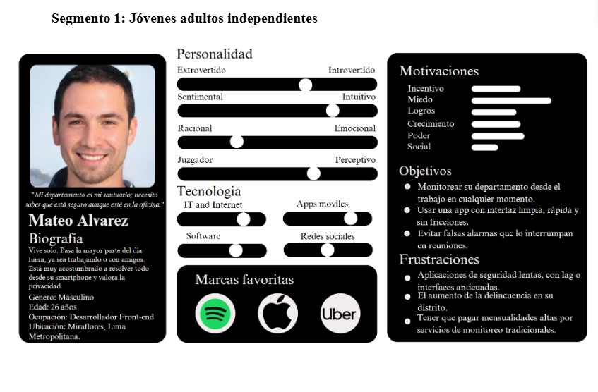

  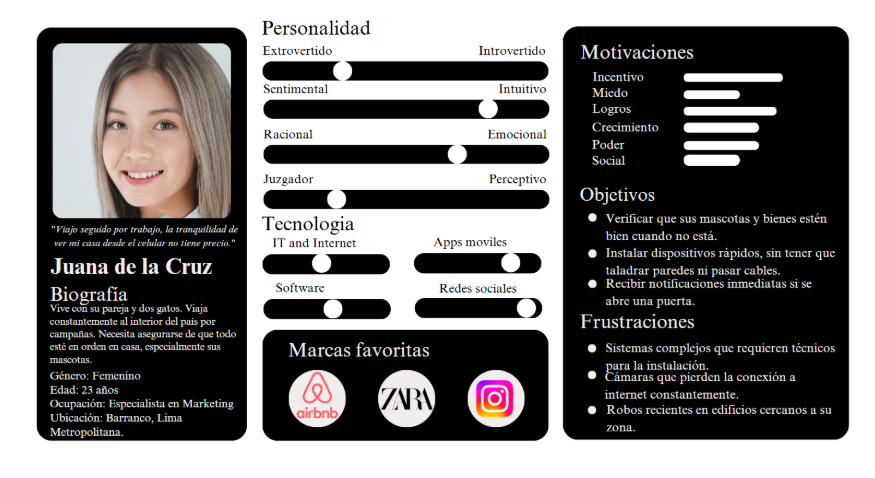

---

  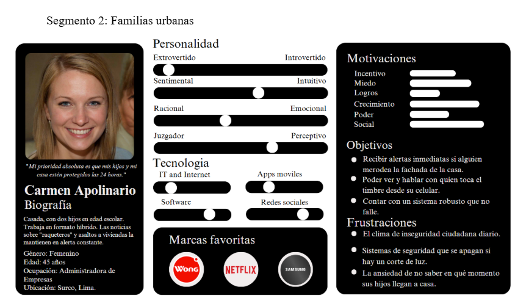

  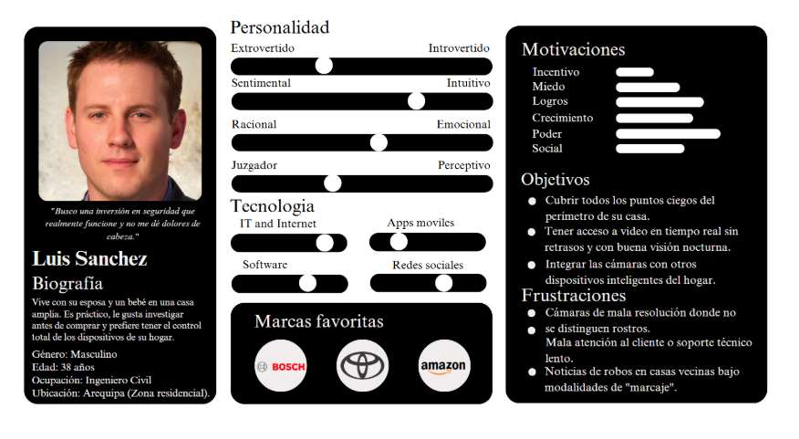

---

  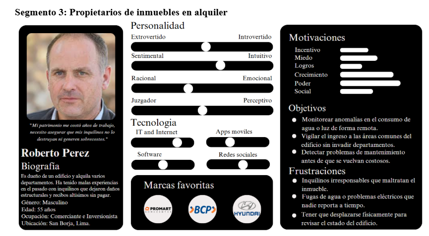

  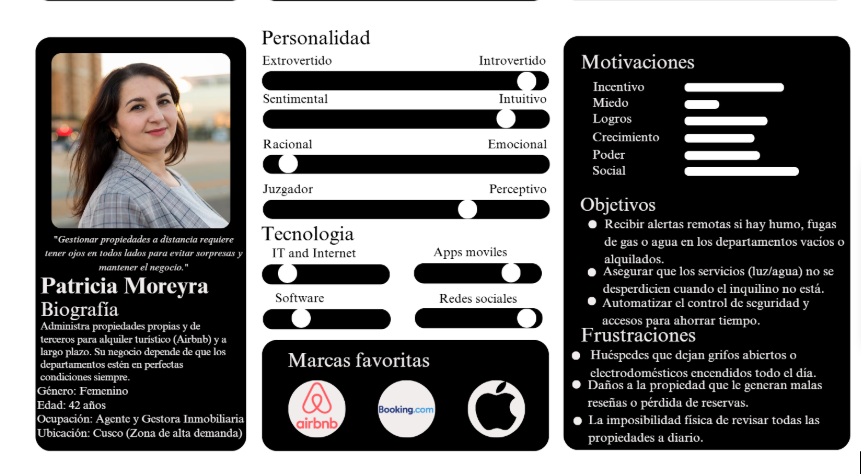

## 2.3.2. User Task Matrix

### Segmento objetivo 1: Jóvenes adultos independientes

| Tarea del usuario | Frecuencia | Importancia |
|-------------------|------------|-------------|
| Verificar que puertas, ventanas y accesos queden bien asegurados antes de salir | Alta | Alta |
| Supervisar el estado del hogar cuando no se encuentra presente | Alta | Alta |
| Detectar ingresos no autorizados o movimientos sospechosos | Alta | Alta |
| Confirmar que no existan incidentes internos, como humo, fugas o fallas | Media | Alta |
| Revisar rápidamente si todo está en orden al regresar a casa | Alta | Media |
| Coordinar una acción inmediata ante una alerta o situación anómala | Media | Alta |

---

### Segmento objetivo 2: Familias urbanas

| Tarea del usuario | Frecuencia | Importancia |
|-------------------|------------|-------------|
| Verificar que los accesos del hogar estén protegidos durante el día y la noche | Alta | Alta |
| Supervisar constantemente el estado del hogar cuando la familia no está reunida en casa | Alta | Alta |
| Detectar robos, intentos de ingreso o situaciones sospechosas | Alta | Alta |
| Identificar incidentes internos, como humo, fugas de gas o fallas eléctricas | Alta | Alta |
| Coordinar una respuesta rápida para proteger a los integrantes del hogar | Alta | Alta |
| Revisar eventos o incidentes ocurridos en la vivienda para tomar decisiones | Media | Alta |

---

### Segmento objetivo 3: Propietarios de inmuebles en alquiler

| Tarea del usuario | Frecuencia | Importancia |
|-------------------|------------|-------------|
| Supervisar el estado general del inmueble cuando está siendo ocupado por terceros | Alta | Alta |
| Detectar daños, usos inadecuados o situaciones anómalas dentro de la propiedad | Alta | Alta |
| Verificar que no existan incidentes como fugas, humo o problemas con los servicios básicos | Alta | Alta |
| Controlar el uso adecuado de recursos como agua, luz o gas | Alta | Alta |
| Revisar incidentes ocurridos en el inmueble para prevenir daños mayores | Alta | Alta |
| Confirmar que la propiedad permanezca segura frente a accesos no autorizados | Media | Alta |

## 2.3.3. User Journey Mapping

### Mapa de viaje: Jóvenes Adultos Independientes

  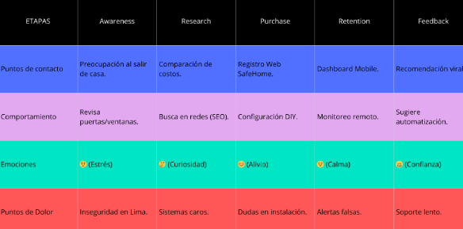

 
Este ecosistema integra una arquitectura IoT con el viaje emocional del usuario. Todo inicia 
cuando el estrés por la inseguridad impulsa al cliente a registrarse en la App y vincular 
sensores mediante Google Cloud, transformando la ansiedad inicial en alivio gracias a una 
configuración técnica sencilla (DIY) y geolocalizada con Google Maps.

En la fase operativa, el sistema garantiza la calma del usuario mediante el monitoreo 
constante de telemetría. Ante cualquier anomalía, se activan alertas críticas vía Twilio y 
Firebase, resolviendo el miedo a la desprotección. Finalmente, el flujo cierra con la 
monetización mediante Niubiz, donde el pago de un plan Premium convierte los datos técnicos 
en reportes de valor que generan confianza y fomentan la recomendación del servicio.

---

### Mapa de viaje: Familias Urbanas

  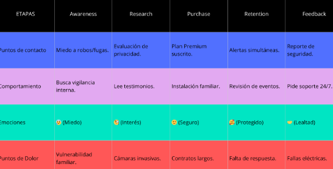

 
Este mapa de viaje para Familias Urbanas se enfoca en la protección del hogar y la 
privacidad, complementando el flujo técnico anterior con las siguientes etapas:

- **Necesidad y Validación:** El viaje inicia por el miedo a robos o fugas, lo que lleva a 
  la familia a buscar vigilancia interna. En la fase de investigación, su prioridad es la 
  privacidad (evitar cámaras invasivas), buscando testimonios que validen la confiabilidad 
  del sistema.

- **Adopción y Protección:** Al contratar el Plan Premium, la familia experimenta seguridad. 
  El comportamiento clave aquí es la instalación familiar (participativa), aunque temen los 
  contratos largos. Durante el uso cotidiano (Retention), se sienten protegidos gracias a las 
  alertas simultáneas para varios miembros, aunque la falta de respuesta rápida es su mayor 
  punto de dolor.

- **Fidelización Crítica:** El ciclo cierra con la entrega de reportes de seguridad que 
  generan lealtad. Sin embargo, este segmento es más exigente: demandan soporte 24/7 y se 
  ven afectados por fallas eléctricas, lo que refuerza la oportunidad técnica de implementar 
  sistemas de respaldo de energía mencionados en el primer diagrama.

---

### Mapa de viaje: Propietarios de inmuebles en alquiler

  

 
Este esquema detalla el ciclo operativo de gestión, que representa la interacción cotidiana 
y lógica del usuario con la plataforma una vez superada la instalación. El proceso comienza 
con las etapas de Acceso y Supervisión, donde el usuario entra al sistema con una mentalidad 
de verificación rápida; aquí, la prioridad emocional es el enfoque y el control, lo que 
genera la oportunidad de diseñar un dashboard de entrada directa que confirme que todos los 
dispositivos están en línea de un solo vistazo.

Posteriormente, el flujo avanza hacia el **Monitoreo y la Gestión**, fases donde el usuario 
analiza eventos en tiempo real con una actitud de atención y organización. En este punto, el 
pensamiento central es la discriminación de alertas para "priorizar lo importante", lo que 
valida técnicamente la necesidad de contar con filtros eficientes y una entrega de información 
inmediata.

Finalmente, el ciclo cierra con la **Evaluación y Optimización**, un proceso analítico donde 
se revisa el historial de eventos para ajustar configuraciones. Esta última etapa busca 
transformar los datos históricos en una sensación de seguridad proactiva, permitiendo que el 
sistema no solo reaccione, sino que evolucione según los patrones detectados por el usuario.

### 2.3.4. Empathy Mapping

  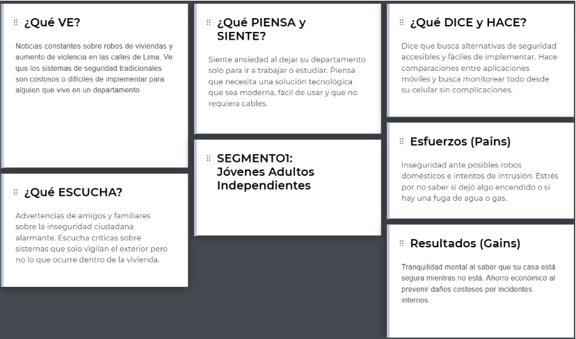

  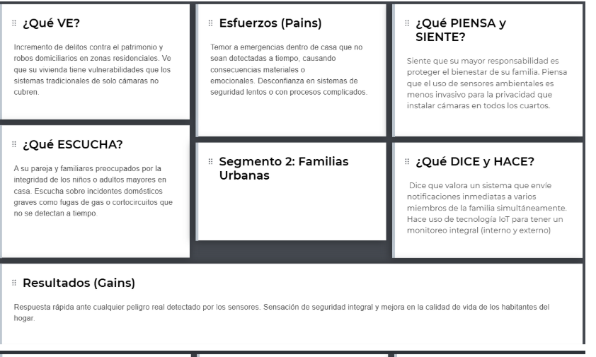

 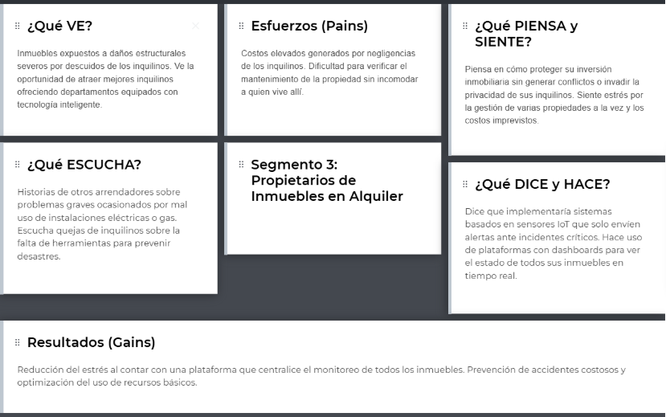

## 2.4. Big Picture Event Storming

 [Ver en Miro](https://miro.com/app/board/uXjVJeUTlWk=/?share_link_id=671299579643)

 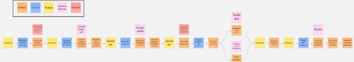

El sistema opera como un ecosistema integrado donde el Usuario y el Sensor IoT son los 
actores principales. El flujo comienza con el registro del usuario en la aplicación móvil, 
un proceso crítico que busca vincular la identidad del cliente con su ubicación física 
mediante la Google Maps API. Una vez configurada la cuenta, el usuario sincroniza el hardware 
mediante el escaneo de un código QR, estableciendo un puente digital que permite al sensor 
iniciar el monitoreo ambiental y el envío constante de telemetría hacia la infraestructura 
de Google Cloud.

---

### Comandos y Ejecución Técnica

La operatividad se basa en comandos específicos que transforman las acciones del usuario en 
estados del sistema. Tras el encendido de los sensores, el dispositivo entra en un estado de 
vigilancia activa. Cuando el hardware procesa una lectura fuera de los parámetros normales, 
el sistema ejecuta el comando de disparo del protocolo de emergencia de forma autónoma. Este 
bloque técnico es el corazón del servicio, pues coordina la lógica interna necesaria para 
transformar una señal física en una respuesta digital inmediata antes de informar a los 
sistemas de mensajería externos.

---

### Eventos y Notificación de Crisis

Los eventos marcan los hitos de éxito o alerta dentro del diagrama. El evento más crítico es 
la **"Anomalía detectada"**, que actúa como el disparador para una arquitectura de 
comunicación multicanal. A través de la **Twilio API**, el sistema garantiza el envío de un 
SMS, mientras que **Firebase Cloud Messaging** gestiona las notificaciones push. Este flujo 
de eventos asegura que el usuario sea notificado por diversas vías, culminando en la 
recepción de la alerta de emergencia en su dispositivo móvil para una respuesta oportuna.

---

### Monetización y Ciclo de Pago

La fase final del diagrama describe el modelo de negocio y la entrega de valor recurrente. 
El usuario tiene la opción de ejecutar el comando de pago para acceder a un plan Premium, 
proceso gestionado externamente por la pasarela **Niubiz**. Una vez procesado el pago, se 
activan eventos de confirmación que habilitan funciones avanzadas, como la generación de 
reportes mensuales detallados. Este cierre de ciclo no solo monetiza la solución, sino que 
refuerza la confianza del cliente mediante la entrega de datos históricos sobre su seguridad.

---

### Problemas y Oportunidades Identificados

A lo largo del flujo se presentan **"hotspots"** que señalan desafíos críticos de diseño. 
Existe una preocupación latente por la validación de identidad para prevenir fraudes durante 
el alta del servicio, así como una vulnerabilidad técnica ante posibles cortes de energía o 
señal WiFi que podrían silenciar al sensor.

No obstante, estas debilidades representan oportunidades para implementar sistemas de 
respaldo (como baterías internas o redes de baja frecuencia) y mejorar la robustez de la 
plataforma, convirtiendo la gestión de estas crisis en una ventaja competitiva del producto.

## 2.5. Ubiquitous Language

Contenido de la sección.

---

# Capítulo III: Requirements Specification

## 3.1. User Stories

Contenido de la sección.

## 3.2. Impact Mapping

Contenido de la sección.

## 3.3. Product Backlog

Contenido de la sección.

---

# Capítulo IV: Product Design

## 4.1. Style Guidelines

Contenido de la sección.

### 4.1.1. General Style Guidelines

Contenido de la sección.

### 4.1.2. Web Style Guidelines

Contenido de la sección.

## 4.2. Information Architecture

Contenido de la sección.

### 4.2.1. Organization Systems

Contenido de la sección.

### 4.2.2. Labeling Systems

Contenido de la sección.

### 4.2.3. SEO Tags and Meta Tags

Contenido de la sección.

### 4.2.4. Searching Systems

Contenido de la sección.

### 4.2.5. Navigation Systems

Contenido de la sección.

## 4.3. Landing Page UI Design

Contenido de la sección.

### 4.3.1. Landing Page Wireframe

Contenido de la sección.

### 4.3.2. Landing Page Mock-up

Contenido de la sección.

## 4.4. Web Applications UX/UI Design

Contenido de la sección.

### 4.4.1. Web Applications Wireframes

Contenido de la sección.

### 4.4.2. Web Applications Wireflow Diagrams

Contenido de la sección.

### 4.4.3. Web Applications Mock-ups

Contenido de la sección.

### 4.4.4. Web Applications User Flow Diagrams

Contenido de la sección.

## 4.5. Web Applications Prototyping

Contenido de la sección.

## 4.6. Domain-Driven Software Architecture

Contenido de la sección.

### 4.6.1. Design-Level Event Storming

Contenido de la sección.

### 4.6.2. Software Architecture Context Diagram

Contenido de la sección.

### 4.6.3. Software Architecture Container Diagrams

Contenido de la sección.

### 4.6.4. Software Architecture Components Diagrams

Contenido de la sección.

## 4.7. Software Object-Oriented Design

Contenido de la sección.

### 4.7.1. Class Diagrams

Contenido de la sección.

## 4.8. Database Design

Contenido de la sección.

### 4.8.1. Database Diagrams

Contenido de la sección.

---

# Capítulo V: Product Implementation, Validation & Deployment

## 5.1. Software Configuration Management

Contenido de la sección.

### 5.1.1. Software Development Environment Configuration

Contenido de la sección.

### 5.1.2. Source Code Management

Contenido de la sección.

### 5.1.3. Source Code Style Guide & Conventions

Contenido de la sección.

### 5.1.4. Software Deployment Configuration

Contenido de la sección.

## 5.2. Landing Page, Services & Applications Implementation

Contenido de la sección.

### 5.2.1. Sprint 1

Contenido de la sección.

#### 5.2.1.1. Sprint Planning 1

Contenido de la sección.

#### 5.2.1.2. Aspect Leaders and Collaborators

Contenido de la sección.

#### 5.2.1.3. Sprint Backlog 1

Contenido de la sección.

#### 5.2.1.4. Development Evidence for Sprint Review

Contenido de la sección.

#### 5.2.1.5. Execution Evidence for Sprint Review

Contenido de la sección.

#### 5.2.1.6. Services Documentation Evidence for Sprint Review

Contenido de la sección.

#### 5.2.1.7. Software Deployment Evidence for Sprint Review

Contenido de la sección.

#### 5.2.1.8. Team Collaboration Insights during Sprint

Contenido de la sección.

---

# Conclusiones

Contenido de conclusiones.

---

# Bibliografía

Contenido de bibliografía en formato APA 7.

---

# Anexos

Contenido de anexos.
