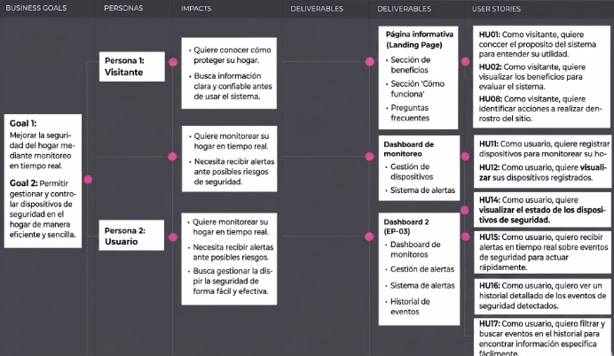

### Universidad Peruana de Ciencias Aplicadas  
### Ingeniería de Software  
### 2026-1  

### NRC: 11834  
### Docente: Ivan Robles Fernandez
### Informe de Trabajo Final  

### SoftTech  
### SafeHome  

| **Código** | **Integrante** |
|------------|----------------|
| U20241D932 | Briguite Eryka Carhuaz Centeno |
| U202319329 | Gonzalo Alexander Jaime Forcelledo |
| U201911393 | Mauricio Jared Padilla Merino |
| U202115654 | Luis Ángel Pililaca Vidal |
| U202411373 | Valeria Alexandra Rojas Gómez |

### Abril 2026

---

# Registro de Versiones del Informe

| Versión | Fecha | Autor | Descripción de modificación |
|---------|-------|-------|-----------------------------|
| 1.0 | 08/04/2026 | Grupo SoftTech | Se avanzaron los capítulos correspondientes al AV1 del proyecto SafeHome. |

---

# Project Report Collaboration Insights

**URL del Repositorio:** [SafeHome Project Report](https://github.com/upc-pre-2610-1ASI0729-11834-SoftTech/SafeHome-report)

El informe del proyecto SafeHome fue desarrollado de manera colaborativa por el equipo SoftTech mediante GitHub. Para organizar el trabajo, se utilizó una rama principal `main`, una rama de integración `develop` y ramas `feature/chapter-*` para distribuir el desarrollo del reporte por capítulos.

Cada integrante trabajó en la rama correspondiente a su capítulo o sección asignada, realizando commits con mensajes descriptivos bajo la convención de Conventional Commits. Esta organización permitió mantener la trazabilidad de los cambios, evidenciar la participación del equipo y facilitar la integración progresiva del informe.

---

# Student Outcome ABET 3

**Capacidad de comunicarse efectivamente con un rango de audiencias.**

| Criterio específico | Descripción | Acciones realizadas | Conclusiones |
|--------------------|-------------|---------------------|--------------|
| 3.c1. Comunica oralmente con efectividad a diferentes rangos de audiencia | El estudiante comunica resultados y proceso de ingeniería aplicado para el ciclo de desarrollo y despliegue de una solución web distribuida bajo una arquitectura orientada a servicios, con enfoque innovador e inclusivo. | AV1: El equipo explicó los avances del proyecto SafeHome, incluyendo la problemática, análisis de usuarios, diseño UX/UI, propuesta técnica e implementación inicial. | El equipo logró comunicar oralmente los principales resultados del avance, sustentando las decisiones tomadas en el diseño y desarrollo de la solución. |
| 3.c2. Comunica por escrito con efectividad a diferentes rangos de audiencia | El estudiante comunica por escrito los resultados y el proceso de ingeniería aplicado en el desarrollo de una solución web distribuida. | AV1: El equipo documentó el informe en formato Markdown, registrando evidencias, decisiones de diseño, requisitos, diagramas, arquitectura y avances de implementación. | La documentación permitió comunicar de manera ordenada el proceso de desarrollo del proyecto SafeHome. |

---

# Contenido

- [Registro de Versiones del Informe](#registro-de-versiones-del-informe)
- [Project Report Collaboration Insights](#project-report-collaboration-insights)
- [Student Outcome ABET 3](#student-outcome-abet-3)

- [Capítulo I: Introducción](#capítulo-i-introducción)
  - [1.1. Startup Profile](#11-startup-profile)
    - [1.1.1. Descripción de la Startup](#111-descripción-de-la-startup)
    - [1.1.2. Perfiles de integrantes del equipo](#112-perfiles-de-integrantes-del-equipo)
  - [1.2. Solution Profile](#12-solution-profile)
    - [1.2.1. Antecedentes y problemática](#121-antecedentes-y-problemática)
    - [1.2.2. Lean UX Process](#122-lean-ux-process)
      - [1.2.2.1. Lean UX Problem Statements](#1221-lean-ux-problem-statements)
      - [1.2.2.2. Lean UX Assumptions](#1222-lean-ux-assumptions)
      - [1.2.2.3. Lean UX Hypothesis Statements](#1223-lean-ux-hypothesis-statements)
      - [1.2.2.4. Lean UX Canvas](#1224-lean-ux-canvas)
  - [1.3. Segmentos objetivo](#13-segmentos-objetivo)

- [Capítulo II: Requirements Elicitation & Analysis](#capítulo-ii-requirements-elicitation--analysis)
  - [2.1. Competidores](#21-competidores)
    - [2.1.1. Análisis competitivo](#211-análisis-competitivo)
    - [2.1.2. Estrategias y tácticas frente a competidores](#212-estrategias-y-tácticas-frente-a-competidores)
  - [2.2. Entrevistas](#22-entrevistas)
    - [2.2.1. Diseño de entrevistas](#221-diseño-de-entrevistas)
    - [2.2.2. Registro de entrevistas](#222-registro-de-entrevistas)
    - [2.2.3. Análisis de entrevistas](#223-análisis-de-entrevistas)
  - [2.3. Needfinding](#23-needfinding)
    - [2.3.1. User Personas](#231-user-personas)
    - [2.3.2. User Task Matrix](#232-user-task-matrix)
    - [2.3.3. User Journey Mapping](#233-user-journey-mapping)
    - [2.3.4. Empathy Mapping](#234-empathy-mapping)
  - [2.4. Big Picture Event Storming](#24-big-picture-event-storming)
  - [2.5. Ubiquitous Language](#25-ubiquitous-language)

- [Capítulo III: Requirements Specification](#capítulo-iii-requirements-specification)
  - [3.1. User Stories](#31-user-stories)
  - [3.2. Impact Mapping](#32-impact-mapping)
  - [3.3. Product Backlog](#33-product-backlog)

- [Capítulo IV: Product Design](#capítulo-iv-product-design)
  - [4.1. Style Guidelines](#41-style-guidelines)
    - [4.1.1. General Style Guidelines](#411-general-style-guidelines)
    - [4.1.2. Web Style Guidelines](#412-web-style-guidelines)
  - [4.2. Information Architecture](#42-information-architecture)
    - [4.2.1. Organization Systems](#421-organization-systems)
    - [4.2.2. Labeling Systems](#422-labeling-systems)
    - [4.2.3. SEO Tags and Meta Tags](#423-seo-tags-and-meta-tags)
    - [4.2.4. Searching Systems](#424-searching-systems)
    - [4.2.5. Navigation Systems](#425-navigation-systems)
  - [4.3. Landing Page UI Design](#43-landing-page-ui-design)
    - [4.3.1. Landing Page Wireframe](#431-landing-page-wireframe)
    - [4.3.2. Landing Page Mock-up](#432-landing-page-mock-up)
  - [4.4. Web Applications UX/UI Design](#44-web-applications-uxui-design)
    - [4.4.1. Web Applications Wireframes](#441-web-applications-wireframes)
    - [4.4.2. Web Applications Wireflow Diagrams](#442-web-applications-wireflow-diagrams)
    - [4.4.3. Web Applications Mock-ups](#443-web-applications-mock-ups)
    - [4.4.4. Web Applications User Flow Diagrams](#444-web-applications-user-flow-diagrams)
  - [4.5. Web Applications Prototyping](#45-web-applications-prototyping)
  - [4.6. Domain-Driven Software Architecture](#46-domain-driven-software-architecture)
    - [4.6.1. Design-Level Event Storming](#461-design-level-event-storming)
    - [4.6.2. Software Architecture Context Diagram](#462-software-architecture-context-diagram)
    - [4.6.3. Software Architecture Container Diagrams](#463-software-architecture-container-diagrams)
    - [4.6.4. Software Architecture Components Diagrams](#464-software-architecture-components-diagrams)
  - [4.7. Software Object-Oriented Design](#47-software-object-oriented-design)
    - [4.7.1. Class Diagrams](#471-class-diagrams)
  - [4.8. Database Design](#48-database-design)
    - [4.8.1. Database Diagrams](#481-database-diagrams)

- [Capítulo V: Product Implementation, Validation & Deployment](#capítulo-v-product-implementation-validation--deployment)
  - [5.1. Software Configuration Management](#51-software-configuration-management)
    - [5.1.1. Software Development Environment Configuration](#511-software-development-environment-configuration)
    - [5.1.2. Source Code Management](#512-source-code-management)
    - [5.1.3. Source Code Style Guide & Conventions](#513-source-code-style-guide--conventions)
    - [5.1.4. Software Deployment Configuration](#514-software-deployment-configuration)
  - [5.2. Landing Page, Services & Applications Implementation](#52-landing-page-services--applications-implementation)
    - [5.2.1. Sprint 1](#521-sprint-1)
      - [5.2.1.1. Sprint Planning 1](#5211-sprint-planning-1)
      - [5.2.1.2. Aspect Leaders and Collaborators](#5212-aspect-leaders-and-collaborators)
      - [5.2.1.3. Sprint Backlog 1](#5213-sprint-backlog-1)
      - [5.2.1.4. Development Evidence for Sprint Review](#5214-development-evidence-for-sprint-review)
      - [5.2.1.5. Execution Evidence for Sprint Review](#5215-execution-evidence-for-sprint-review)
      - [5.2.1.6. Services Documentation Evidence for Sprint Review](#5216-services-documentation-evidence-for-sprint-review)
      - [5.2.1.7. Software Deployment Evidence for Sprint Review](#5217-software-deployment-evidence-for-sprint-review)
      - [5.2.1.8. Team Collaboration Insights during Sprint](#5218-team-collaboration-insights-during-sprint)

- [Conclusiones](#conclusiones)
- [Bibliografía](#bibliografía)
- [Anexos](#anexos)

---

# Capítulo I: Introducción

## 1.1. Startup Profile

Contenido del capítulo I.

### 1.1.1. Descripción de la Startup

Contenido de la sección.

### 1.1.2. Perfiles de integrantes del equipo

Contenido de la sección.

## 1.2. Solution Profile

Contenido de la sección.

### 1.2.1. Antecedentes y problemática

Contenido de la sección.

### 1.2.2. Lean UX Process

Contenido de la sección.

#### 1.2.2.1. Lean UX Problem Statements

Contenido de la sección.

#### 1.2.2.2. Lean UX Assumptions

Contenido de la sección.

#### 1.2.2.3. Lean UX Hypothesis Statements

Contenido de la sección.

#### 1.2.2.4. Lean UX Canvas

Contenido de la sección.

## 1.3. Segmentos objetivo

Contenido de la sección.

---

# Capítulo II: Requirements Elicitation & Analysis

## 2.1. Competidores

En el mercado peruano de sistemas de seguridad para el hogar existe una amplia oferta de soluciones. Sin embargo, la mayoría de estas empresas se concentran principalmente en la videovigilancia y monitoreo perimetral externo, dejando en un segundo plano el monitoreo de anomalías internas, tales como fugas de gas, agua o consumo eléctrico inusual.

Si bien algunas empresas locales y con presencia internacional en el Perú ofrecen soluciones de seguridad, en el mercado internacional se encuentran propuestas más integrales que abordan la seguridad del hogar tanto de forma externa como interna. Estas empresas internacionales, a diferencia de las nacionales, implementan sensores IoT avanzados para la detección de fugas, monitoreo energético y alertas en tiempo real, todo ello integrado en una misma plataforma.

### 2.1.1. Análisis competitivo

| Categoría                     | SafeHome                                                                 | Prosegur Alarmas                                             | Verisure                                                      | Ring (Amazon)                                                 | Vivint Smart Home                                             |
|------------------------------|--------------------------------------------------------------------------|----------------------------------------------------------------|----------------------------------------------------------------|----------------------------------------------------------------|----------------------------------------------------------------|
| **Overview**                 | Startup tecnológica enfocada en seguridad del hogar con IoT y analítica | Empresa consolidada en seguridad física en LATAM              | Empresa internacional de alarmas inteligentes                  | Marca de dispositivos inteligentes DIY                        | Empresa de seguridad y automatización del hogar               |
| **Ventaja Competitiva**      | Bajo costo, plataforma centralizada, integración IoT flexible, UX simple | Marca reconocida, monitoreo 24/7, instalación incluida        | Tecnología avanzada, respuesta rápida                          | Integración con ecosistema Amazon, fácil instalación          | Ecosistema integrado, automatización avanzada                 |
| **Mercado Objetivo**         | Familias urbanas, jóvenes profesionales, domótica accesible              | Hogares NSE medio-alto, empresas                              | Hogares premium, negocios                                     | Usuarios tecnológicos, mercado global                         | Hogares premium, mercado tecnológico                          |
| **Estrategias de Marketing** | Marketing digital, modelo freemium, alianzas IoT                         | Publicidad tradicional, ventas directas                       | Marketing agresivo, venta consultiva                          | E-commerce, marketing digital                                | Marketing digital y ventas integradas                         |
| **Productos & Servicios**    | Monitoreo en tiempo real, alertas, sensores IoT, dashboard web           | Alarmas, cámaras, monitoreo profesional                       | Cámaras inteligentes, sensores                               | Seguridad inteligente, dispositivos DIY                       | Automatización del hogar, seguridad inteligente               |
| **Precios & Costos**         | Freemium + suscripción accesible                                         | Costos elevados + mensualidad                                | Alto costo + suscripción                                      | Pago único + suscripción opcional                            | Alto costo + suscripción                                     |
| **Canales de Distribución**  | Web + app móvil                                                          | Web + ventas presenciales                                     | Web + ventas directas                                         | Online (Amazon)                                              | Web + ventas directas                                         |
| **Fortalezas**               | Alta accesibilidad económica, flexibilidad tecnológica, UX moderna       | Alta confianza de marca, soporte profesional                  | Tecnología robusta, reconocimiento global                     | Fácil uso, ecosistema integrado                              | Automatización avanzada                                       |
| **Debilidades**              | Baja reputación inicial, dependencia tecnológica del usuario             | Poca flexibilidad, costos altos                              | Alto precio, instalación requerida                            | Soporte limitado en Perú                                     | Dependencia de internet                                       |
| **Oportunidades**            | Crecimiento del IoT, baja penetración de soluciones integradas           | Digitalización de servicios                                  | Expansión en LATAM                                            | Crecimiento del smart home                                   | Expansión tecnológica                                         |
| **Amenazas**                 | Competidores consolidados, desconfianza en nuevas soluciones             | Nuevas soluciones más económicas                             | Competencia global                                            | Soluciones DIY más económicas                                | Alternativas locales más económicas                          |
## 2.1.2. Estrategias y tácticas frente a competidores

Según el análisis realizado, SafeHome identifica varias oportunidades para diferenciarse 
en un mercado donde la mayoría de las soluciones se concentran en la seguridad perimetral 
externa y videovigilancia. Mientras que los competidores locales como Prosegur Alarmas y 
Verisure destacan por su monitoreo profesional 24/7 y respuesta rápida, y las soluciones 
internacionales como Ring y Vivint se centran principalmente en video y alarmas, SafeHome 
propone una estrategia centrada en el monitoreo integral (externo e interno) y una mayor 
accesibilidad.

Las principales estrategias y tácticas que se adoptarán son las siguientes:

---

### 1. Diferenciación por valor agregado en monitoreo interno

A diferencia de la mayoría de competidores que ofrecen un enfoque limitado en la detección 
de anomalías internas, SafeHome integrará sensores IoT especializados para detectar fugas 
de gas, agua y consumos eléctricos inusuales. Esta funcionalidad responde directamente a 
las necesidades identificadas en las entrevistas realizadas a los segmentos objetivo, donde 
los usuarios expresaron preocupación por riesgos domésticos internos además de las 
intrusiones externas.

---

### 2. Accesibilidad y modelo de negocio flexible

Mientras que Prosegur, Verisure y Vivint suelen requerir contratos a largo plazo y cuotas 
mensuales elevadas, SafeHome implementará un modelo de suscripción más accesible y flexible 
(freemium), orientado especialmente a jóvenes adultos independientes y familias de ingresos 
medios que viven en departamentos. De esta forma se busca reducir la barrera de entrada que 
actualmente existe en el mercado.

---

### 3. Enfoque en plataforma web responsive como canal principal

La mayoría de competidores priorizan aplicaciones móviles o sistemas cerrados con central 
receptora. SafeHome desarrollará una plataforma web responsive como interfaz principal, 
permitiendo un acceso más cómodo desde cualquier dispositivo (computadora, tablet o celular) 
sin necesidad de instalar aplicaciones adicionales. Esto mejora la experiencia de usuario y 
facilita el monitoreo para aquellos que prefieren interfaces web.

---

### 4. Fácil instalación y enfoque DIY *(Do It Yourself)*

Se priorizará un diseño de sensores plug-and-play con configuración intuitiva a través de 
la plataforma web, reduciendo la dependencia de instalación profesional costosa que exigen 
la mayoría de competidores locales.

---

### 5. Estrategia de posicionamiento inicial

SafeHome se posicionará inicialmente en el segmento de jóvenes adultos independientes y 
familias urbanas en Lima Metropolitana, ofreciendo una solución más económica y tecnológica 
que combine seguridad externa con monitoreo inteligente interno, cerrando la brecha 
identificada en el mercado peruano.

---

Estas estrategias permitirán a SafeHome no solo competir, sino también crear un nicho propio 
en el mercado de seguridad doméstica inteligente, enfocándose en la seguridad integral 
accesible y en la tranquilidad real de los usuarios.

## 2.2. Entrevistas

Contenido de la sección.

## 2.2.1. Diseño de entrevistas

### Segmento 1: Jóvenes adultos independientes

1. ¿Podrías indicarnos tu edad, en qué distrito resides y con quién compartes tu departamento actualmente?
2. ¿Qué dispositivos o aplicaciones tecnológicas utilizas diariamente para organizar tu rutina, tus finanzas o el manejo de tu hogar?
3. Cuando dejas tu departamento solo para ir a estudiar o trabajar, ¿qué es lo que más te preocupa respecto a la seguridad de tus pertenencias?
4. ¿Has tenido alguna experiencia directa o cercana de robo o intento de intrusión en tu vivienda? ¿Cómo procediste?
5. Más allá de los robos, ¿alguna vez te ha generado estrés dudar si dejaste conectado algún electrodoméstico o el agua corriendo al salir de casa?
6. Si pudieras monitorear el estado de tu departamento en tiempo real desde tu celular, ¿qué alertas o notificaciones considerarías absolutamente necesarias?
7. ¿Estarías dispuesto a instalar sensores IoT (como detectores de movimiento, humo o gas) por tu cuenta si la configuración desde la app fuera intuitiva y sin cables?
8. Para ti, ¿qué funcionalidad diferenciaría a una aplicación de seguridad básica de una que consideramos imprescindible de revisar todos los días?
9. ¿Cuánto estarías dispuesto a invertir mensualmente por una suscripción que te garantice el monitoreo remoto de tu hogar y alertas inmediatas ante cualquier anomalía?
10. ¿Conoces a otros jóvenes independientes que compartan estas mismas preocupaciones y a quienes les sería útil una plataforma automatizada como esta?

---

### Segmento 2: Familias urbanas

1. ¿Podría indicarnos su edad, el distrito donde reside y cuántas personas conforman su núcleo familiar, incluyendo niños o adultos mayores?
2. Actualmente, ¿cuenta con algún sistema o medida de seguridad en su hogar (cámaras, alarmas, vigilancia vecinal)? ¿Qué tan efectivo le resulta en el día a día?
3. En el contexto actual, ¿cuál considera que es la principal vulnerabilidad de su vivienda frente a la inseguridad en la ciudad?
4. Además de la amenaza externa, ¿qué tan preocupante es para usted el riesgo de incidentes domésticos graves como fugas de gas, cortocircuitos o inundaciones?
5. ¿Alguna vez su familia ha enfrentado una emergencia dentro de casa que no fue detectada a tiempo? ¿Cuáles fueron las consecuencias materiales o emocionales?
6. Nuestro proyecto busca alertar sobre estas anomalías de forma inteligente. ¿Qué valor le daría a un sistema que envíe notificaciones inmediatas a su celular y al de su pareja simultáneamente ante un peligro?
7. En caso de una emergencia real detectada por los sensores (como una intrusión o incendio), ¿preferiría que el sistema alerte automáticamente a las autoridades o prefiere verificar la notificación usted primero?
8. ¿Qué características específicas tendría que cumplir un sistema de monitoreo para que usted confíe plenamente en él para proteger el bienestar de su familia?
9. Si esta tecnología le permitiera prevenir accidentes muy costosos, ¿consideraría pagar un servicio de monitoreo Premium mensual? ¿Qué rango de precio le parecería manejable?
10. ¿Considera que el uso de sensores ambientales (movimiento, humo, gas) es una opción más cómoda y menos invasiva para la privacidad de su familia en comparación con instalar cámaras en todos los cuartos?

---

### Segmento 3: Propietarios de inmuebles en alquiler

1. ¿Podría indicarnos su edad, en qué distritos se ubican sus propiedades y cuántos inmuebles tiene actualmente destinados al alquiler?
2. ¿Cuál es el proceso o método que utiliza hoy en día para verificar el buen estado de mantenimiento y seguridad de sus propiedades alquiladas?
3. En su experiencia como arrendador, ¿cuáles han been los problemas más graves o costosos ocasionados por descuidos de los inquilinos (ej. mal uso de agua, gas, o instalaciones eléctricas)?
4. ¿Alguna vez la negligencia de un inquilino ha dejado su propiedad expuesta a robos, incendios o daños estructurales severos? ¿Cómo se enteró de lo sucedido?
5. ¿Qué tan complejo le resulta asegurarse de que su inversión inmobiliaria está protegida sin generar conflictos o invadir la privacidad de las personas que viven allí?
6. Si existiera un sistema basado en sensores IoT que le envíe alertas al celular solo ante incidentes críticos (fugas de agua, gas o picos inusuales de consumo) sin usar cámaras de video, ¿lo implementaría?
7. ¿Cree que ofrecer un departamento pre-equipado con tecnología inteligente y prevención de desastres le permitiría atraer a mejores inquilinos o justificar un mayor costo de alquiler?
8. Pensando en la gestión de varias propiedades a la vez, ¿le resultaría útil una plataforma web donde pueda ver un panel (dashboard) con el estado de los servicios y sensores de todos sus inmuebles en tiempo real?
9. A nivel económico, ¿preferiría que los equipos de sensores requieran un pago único inicial por la instalación, o un modelo de suscripción mensual que incluya mantenimiento y soporte técnico continuo?
10. ¿Qué otra funcionalidad le pediría a una plataforma de monitoreo de inmuebles para que realmente le reduzca el estrés y los costos imprevistos como propietario?

### 2.2.2. Registro de entrevistas

Contenido de la sección.

## 2.2.3. Análisis de entrevistas

### Análisis Segmento 1: Jóvenes adultos independientes

Los entrevistados que viven en ciudades con menor nivel de criminalidad indicaron que no 
consideran prioritaria la seguridad contra robos, ya que cuentan con vigilancia local. Sin 
embargo, manifestaron preocupación por riesgos domésticos como inundaciones, fugas de gas 
o accidentes eléctricos, especialmente cuando hay niños o cuando la vivienda queda sola. 
Valoraron positivamente un sistema inteligente que permita anticipar incidentes mediante 
sensores, destacando la importancia de la certificación tecnológica, la protección de datos 
y la confiabilidad del proveedor. Consideran que los sensores ambientales son menos invasivos 
que las cámaras y representan una alternativa adecuada para mantener la privacidad familiar.

---

### Análisis Segmento 2: Familias urbanas

En entornos urbanos, las entrevistas muestran que las familias sí perciben un mayor nivel 
de vulnerabilidad cuando la vivienda queda sola, incluso contando con cámaras o alarmas 
básicas. Los principales insights se relacionan con la necesidad de monitoreo constante sin 
supervisión humana, alertas inmediatas ante intrusiones o accidentes domésticos y herramientas 
que permitan verificar remotamente el estado del hogar desde el celular.

Uno de los participantes expresó que este tipo de alertas puede ayudar a prevenir la pérdida 
de bienes materiales, ahorrando tiempo y dinero, al proteger contra amenazas externas como 
por riesgos internos cotidianos, valorando especialmente sistemas fáciles de instalar, 
automatizados y capaces de enviar notificaciones en tiempo real para reaccionar rápidamente. 
La privacidad también emerge como un factor clave, inclinando la preferencia hacia sensores 
inteligentes que complementen o reemplacen el uso excesivo de cámaras.

---

### Análisis Segmento 3: Propietarios de inmuebles en alquiler

Las entrevistas con arrendadores revelan que valorarían mucho una propuesta tecnológica que 
permita la protección y supervisión eficiente de sus activos inmobiliarios sin generar 
incomodidad en los inquilinos. Actualmente dependen de visitas presenciales ocasionales para 
verificar el estado de las propiedades, lo que dificulta detectar a tiempo filtraciones, 
descuidos o daños estructurales de sus inmuebles.

Uno de los entrevistados valoró el uso de sensores IoT que permitan monitoreo remoto mediante 
dashboards, y añadió que sería útil implementar una funcionalidad que permita la verificación 
de una alerta por parte del inquilino también. Se señaló además que la ausencia de cámaras 
es vital para preservar la privacidad del arrendatario. Consideran que integrar tecnología 
preventiva puede incrementar el valor del alquiler, atraer mejores inquilinos y justificar 
modelos de suscripción mensual con mantenimiento incluido, posicionando a SafeHome como una 
herramienta de gestión inmobiliaria preventiva además de un sistema de seguridad.

---

### Análisis General

Las entrevistas realizadas a familias y propietarios de inmuebles evidencian que, aunque 
muchos hogares cuentan con medidas básicas de seguridad como vigilancia municipal, cámaras 
externas o visitas periódicas de supervisión, aún existe una preocupación importante por los 
riesgos internos del hogar. Problemas como fugas de gas, incendios, filtraciones de agua o 
descuidos de inquilinos representan amenazas que suelen detectarse tarde, generando pérdidas 
económicas y preocupación constante en los usuarios.

Asimismo, los entrevistados coincidieron en la necesidad de contar con herramientas 
tecnológicas que permitan monitorear sus viviendas o propiedades de forma remota sin invadir 
la privacidad de las personas. Se observa una alta aceptación hacia soluciones basadas en 
sensores inteligentes e Internet de las Cosas (IoT), especialmente aquellas que envíen alertas 
inmediatas ante incidentes críticos y permitan centralizar la información en una plataforma o 
dashboard accesible desde el celular o computadora.

Para el proyecto SafeHome, estos resultados validan la propuesta de desarrollar un sistema de 
monitoreo preventivo enfocado en la detección temprana de riesgos domésticos. Las entrevistas 
confirman que existe una oportunidad real de mercado para una solución segura, no invasiva y 
basada en suscripción mensual, capaz de mejorar la protección del hogar, optimizar la gestión 
de propiedades y brindar tranquilidad tanto a familias como a propietarios arrendadores.

## 2.3. Needfinding

Contenido de la sección.

### 2.3.1. User Personas

Contenido de la sección.

### 2.3.2. User Task Matrix

Contenido de la sección.

### 2.3.3. User Journey Mapping

Contenido de la sección.

### 2.3.4. Empathy Mapping

Contenido de la sección.

## 2.4. Big Picture Event Storming

Contenido de la sección.

## 2.5. Ubiquitous Language

Contenido de la sección.

---

# Capítulo III: Requirements Specification

## 3.1. User Stories

### HU01 - Visualizar propuesta de valor

| Campo | Detalle |
|---|---|
| **User Story ID** | HU01 |
| **Epic ID** | 1 |
| **Title** | Visualizar propuesta de valor |
| **Description** | Como visitante, quisiera conocer el propósito del servicio para entender su utilidad. |

**Acceptance Criteria**

**Escenario 1: Mostrar propuesta de valor al ingresar**

- **Dado** que el visitante ingresa al sitio  
- **Cuando** accede a la página principal  
- **Entonces** el sistema muestra la propuesta de valor  

**Escenario 2: Comprensión del propósito del servicio**

- **Dado** que el visitante navega en la página  
- **Cuando** revisa el contenido  
- **Entonces** encuentra información clara del servicio  

---

### HU02 - Ver beneficios del servicio

| Campo | Detalle |
|---|---|
| **User Story ID** | HU02 |
| **Epic ID** | 1 |
| **Title** | Ver beneficios del servicio |
| **Description** | Como visitante, quisiera conocer los beneficios para evaluar el servicio. |

**Acceptance Criteria**

**Escenario 1: Visualización de beneficios**

- **Dado** que el visitante accede a la sección de beneficios  
- **Cuando** revisa la información  
- **Entonces** el sistema muestra ventajas del servicio  

**Escenario 2: Comprensión de ventajas**

- **Dado** que el contenido está disponible  
- **Cuando** el visitante lo visualiza  
- **Entonces** comprende los beneficios ofrecidos  

---

### HU03 - Explorar servicios disponibles

| Campo | Detalle |
|---|---|
| **User Story ID** | HU03 |
| **Epic ID** | 1 |
| **Title** | Explorar servicios disponibles |
| **Description** | Como visitante, quiero visualizar los tipos de servicios disponibles. |

**Acceptance Criteria**

**Escenario 1: Visualizar lista de servicios**

- **Dado** que el visitante accede a la sección servicios  
- **Cuando** revisa el contenido  
- **Entonces** el sistema muestra los tipos de servicios  

**Escenario 2: Diferenciación de servicios**

- **Dado** que existen múltiples servicios  
- **Cuando** el visitante navega  
- **Entonces** puede diferenciarlos claramente  

---

### HU04 - Visualizar testimonios

| Campo | Detalle |
|---|---|
| **User Story ID** | HU04 |
| **Epic ID** | 1 |
| **Title** | Visualizar testimonios |
| **Description** | Como visitante, quiere ver opiniones para generar confianza. |

**Acceptance Criteria**

**Escenario 1: Mostrar testimonios disponibles**

- **Dado** que el visitante accede a testimonios  
- **Cuando** revisa la sección  
- **Entonces** el sistema muestra experiencias de usuarios  

**Escenario 2: Carga correcta de testimonios**

- **Dado** que hay testimonios disponibles  
- **Cuando** se cargan  
- **Entonces** se muestran correctamente  

---

### HU05 - Ver información de contacto

| Campo | Detalle |
|---|---|
| **User Story ID** | HU05 |
| **Epic ID** | 1 |
| **Title** | Ver información de contacto |
| **Description** | Como visitante, quiere encontrar medios de contacto. |

**Acceptance Criteria**

**Escenario 1: Visualizar datos de contacto**

- **Dado** que el visitante accede al footer  
- **Cuando** revisa la información  
- **Entonces** encuentra datos de contacto  

**Escenario 2: Identificación de canales de comunicación**

- **Dado** que la sección está disponible  
- **Cuando** el visitante interactúa  
- **Entonces** puede identificar medios de comunicación  

---

### HU06 - Navegación entre secciones

| Campo | Detalle |
|---|---|
| **User Story ID** | HU06 |
| **Epic ID** | 1 |
| **Title** | Navegación entre secciones |
| **Description** | Como visitante, quiere desplazarse entre secciones fácilmente. |

**Acceptance Criteria**

**Escenario 1: Redirección a secciones seleccionadas**

- **Dado** que el visitante usa el menú  
- **Cuando** selecciona una sección  
- **Entonces** el sistema lo redirige correctamente  

**Escenario 2: Navegación fluida del sitio**

- **Dado** que la página contiene múltiples secciones  
- **Cuando** navega  
- **Entonces** el desplazamiento es fluido  

---

### HU07 - Acceder desde dispositivos móviles

| Campo | Detalle |
|---|---|
| **User Story ID** | HU07 |
| **Epic ID** | 1 |
| **Title** | Acceder desde dispositivos móviles |
| **Description** | Como visitante, quiero visualizar el sitio en móvil. |

**Acceptance Criteria**

**Escenario 1: Adaptación a dispositivos móviles**

- **Dado** que el visitante usa un dispositivo móvil  
- **Cuando** accede al sitio  
- **Entonces** el contenido se adapta correctamente  

**Escenario 2: Mantenimiento de funcionalidad**

- **Dado** que el sitio es responsive  
- **Cuando** se visualiza  
- **Entonces** mantiene su funcionalidad  

---

### HU08 - Ver llamada a la acción

| Campo | Detalle |
|---|---|
| **User Story ID** | HU08 |
| **Epic ID** | 1 |
| **Title** | Ver llamada a la acción |
| **Description** | Como visitante, quiere identificar acciones a realizar. |

**Acceptance Criteria**

**Escenario 1: Identificación de acciones disponibles**

- **Dado** que el visitante visualiza la página  
- **Cuando** revisa el contenido  
- **Entonces** encuentra llamadas a la acción  

**Escenario 2: Comprensión del siguiente paso**

- **Dado** que existen botones de acción  
- **Cuando** el visitante interactúa  
- **Entonces** entiende el siguiente paso  

---

### HU09 - Ver sección “Cómo funciona”

| Campo | Detalle |
|---|---|
| **User Story ID** | HU09 |
| **Epic ID** | 1 |
| **Title** | Ver sección “Cómo funciona” |
| **Description** | Como visitante, quiero entender el proceso del servicio. |

**Acceptance Criteria**

**Escenario 1: Comprensión del flujo del servicio**

- **Dado** que el visitante accede a la sección  
- **Cuando** revisa el contenido  
- **Entonces** comprende el flujo del servicio  

**Escenario 2: Visualización paso a paso**

- **Dado** que el contenido está disponible  
- **Cuando** lo visualiza  
- **Entonces** se muestra paso a paso  

---

### HU10 - Ver preguntas frecuentes

| Campo | Detalle |
|---|---|
| **User Story ID** | HU10 |
| **Epic ID** | 1 |
| **Title** | Ver preguntas frecuentes |
| **Description** | Como visitante, quiere resolver dudas comunes. |

**Acceptance Criteria**

**Escenario 1: Visualizar preguntas frecuentes**

- **Dado** que el visitante accede a FAQ  
- **Cuando** revisa las preguntas  
- **Entonces** obtiene respuestas claras  

**Escenario 2: Resolución de dudas comunes**

- **Dado** que existen preguntas frecuentes  
- **Cuando** se muestran  
- **Entonces** cubren dudas comunes  

---

### HU11 - Registrar dispositivos de seguridad

| Campo | Detalle |
|---|---|
| **User Story ID** | HU11 |
| **Epic ID** | 2 |
| **Title** | Registrar dispositivos de seguridad |
| **Description** | Como usuario, quiere registrar dispositivos, como sensores o cámaras, para monitorear su hogar. |

**Acceptance Criteria**

**Escenario 1: Registro exitoso de dispositivo**

- **Dado** que el usuario ingresa los datos del dispositivo  
- **Cuando** envía la información  
- **Entonces** el sistema registra el dispositivo  

**Escenario 2: Validación de datos incompletos**

- **Dado** que faltan datos obligatorios  
- **Cuando** intenta registrar el dispositivo  
- **Entonces** el sistema solicita completar la información  

---

### HU12 - Visualizar dispositivos registrados

| Campo | Detalle |
|---|---|
| **User Story ID** | HU12 |
| **Epic ID** | 2 |
| **Title** | Visualizar dispositivos registrados |
| **Description** | Como usuario, quiere visualizar sus dispositivos para monitorear su estado. |

**Acceptance Criteria**

**Escenario 1: Visualización de dispositivos disponibles**

- **Dado** que existen dispositivos registrados  
- **Cuando** accede al panel  
- **Entonces** el sistema muestra la lista de dispositivos  

**Escenario 2: Sin dispositivos registrados**

- **Dado** que no existen dispositivos  
- **Cuando** accede  
- **Entonces** el sistema muestra un mensaje informativo  

---

### HU13 - Activar o desactivar dispositivos

| Campo | Detalle |
|---|---|
| **User Story ID** | HU13 |
| **Epic ID** | 2 |
| **Title** | Activar o desactivar dispositivos |
| **Description** | Como usuario, quiere controlar el estado de sus dispositivos para gestionar la seguridad del hogar. |

**Acceptance Criteria**

**Escenario 1: Activación de dispositivo**

- **Dado** que el dispositivo está desactivado  
- **Cuando** el usuario lo activa  
- **Entonces** el sistema cambia su estado a activo  

**Escenario 2: Desactivación de dispositivo**

- **Dado** que el dispositivo está activo  
- **Cuando** el usuario lo desactiva  
- **Entonces** el sistema lo notifica  

---

### HU14 - Visualizar estado de seguridad del hogar

| Campo | Detalle |
|---|---|
| **User Story ID** | HU14 |
| **Epic ID** | 2 |
| **Title** | Visualizar estado de seguridad del hogar |
| **Description** | Como usuario, quiere conocer el estado general para saber si su hogar está seguro. |

**Acceptance Criteria**

**Escenario 1: Visualización del estado actual**

- **Dado** que existen dispositivos activos  
- **Cuando** el usuario consulta el panel  
- **Entonces** el sistema muestra el estado de seguridad  

**Escenario 2: Actualización del estado en tiempo real**

- **Dado** que un sensor detecta actividad  
- **Cuando** ocurre un evento  
- **Entonces** el sistema actualiza el estado  

---

### HU15 - Recibir alertas de seguridad

| Campo | Detalle |
|---|---|
| **User Story ID** | HU15 |
| **Epic ID** | 2 |
| **Title** | Recibir alertas de seguridad |
| **Description** | Como usuario, quiere recibir alertas para actuar ante posibles riesgos. |

**Acceptance Criteria**

**Escenario 1: Generación de alerta por evento**

- **Dado** que un sensor detecta una anomalía  
- **Cuando** ocurre el evento  
- **Entonces** el sistema genera una alerta  

**Escenario 2: Ausencia de alertas sin eventos**

- **Dado** que no hay actividad sospechosa  
- **Cuando** el sistema monitorea  
- **Entonces** no genera alertas  

---

### HU16 - Visualizar eventos de seguridad en tiempo real

| Campo | Detalle |
|---|---|
| **User Story ID** | HU16 |
| **Epic ID** | 3 |
| **Title** | Visualizar eventos de seguridad en tiempo real |
| **Description** | Como usuario, quiere visualizar eventos detectados para monitorear su hogar en tiempo real. |

**Acceptance Criteria**

**Escenario 1: Visualización de eventos en tiempo real**

- **Dado** que existen eventos generados por sensores  
- **Cuando** el usuario accede al panel  
- **Entonces** el sistema muestra los eventos en tiempo real  

**Escenario 2: Ausencia de eventos**

- **Dado** que no existen eventos recientes  
- **Cuando** el usuario accede al panel  
- **Entonces** el sistema muestra un estado sin actividad  

---

### HU17 - Visualizar detalles de evento

| Campo | Detalle |
|---|---|
| **User Story ID** | HU17 |
| **Epic ID** | 3 |
| **Title** | Visualizar detalles de evento |
| **Description** | Como usuario, quiere ver el detalle de un evento para entender la situación detectada. |

**Acceptance Criteria**

**Escenario 1: Visualización de detalle de evento**

- **Dado** que existe un evento registrado  
- **Cuando** el usuario lo selecciona  
- **Entonces** el sistema muestra su información detallada  

**Escenario 2: Evento no disponible**

- **Dado** que el evento no existe  
- **Cuando** el usuario intenta acceder  
- **Entonces** informa que no está disponible  

---

### HU18 - Marcar evento como atendido

| Campo | Detalle |
|---|---|
| **User Story ID** | HU18 |
| **Epic ID** | 3 |
| **Title** | Marcar evento como atendido |
| **Description** | Como usuario, quiere marcar eventos para llevar control de incidencias. |

**Acceptance Criteria**

**Escenario 1: Marcado exitoso de evento**

- **Dado** que el evento está activo  
- **Cuando** el usuario lo marca como atendido  
- **Entonces** el sistema actualiza su estado  

**Escenario 2: Evento ya atendido**

- **Dado** que el evento ya fue atendido  
- **Cuando** intenta marcarlo nuevamente  
- **Entonces** el sistema lo informa  

---

### HU19 - Eliminar registro de evento

| Campo | Detalle |
|---|---|
| **User Story ID** | HU19 |
| **Epic ID** | 3 |
| **Title** | Eliminar registro de evento |
| **Description** | Como usuario, quiere eliminar eventos para mantener organizado el historial. |

**Acceptance Criteria**

**Escenario 1: Eliminación exitosa de evento**

- **Dado** que existe un evento registrado  
- **Cuando** el usuario lo elimina  
- **Entonces** el sistema lo elimina correctamente  

**Escenario 2: Evento inexistente**

- **Dado** que el evento no existe  
- **Cuando** intenta eliminarlo  
- **Entonces** el sistema informa el error  

---

### HU20 - Visualizar estado general del sistema de seguridad

| Campo | Detalle |
|---|---|
| **User Story ID** | HU20 |
| **Epic ID** | 3 |
| **Title** | Visualizar estado general del sistema de seguridad |
| **Description** | Como usuario, quiere ver un resumen del estado de su hogar para evaluar su seguridad. |

**Acceptance Criteria**

**Escenario 1: Visualización del estado general**

- **Dado** que existen dispositivos conectados  
- **Cuando** el usuario accede al panel principal  
- **Entonces** el sistema muestra el estado general del hogar  

**Escenario 2: Actualización del estado en tiempo real**

- **Dado** que ocurre un evento  
- **Cuando** el sistema lo detecta  
- **Entonces** el estado general se actualiza automáticamente  

---

### HU21 - Filtrar solicitudes

| Campo | Detalle |
|---|---|
| **User Story ID** | HU21 |
| **Epic ID** | 4 |
| **Title** | Filtrar solicitudes |
| **Description** | Como usuario, quiere filtrar solicitudes para encontrar información relevante durante el seguimiento del servicio. |

**Acceptance Criteria**

**Escenario 1: Filtrado exitoso de solicitudes**

- **Dado** que existen solicitudes registradas  
- **Cuando** el usuario aplica criterios de filtrado  
- **Entonces** el sistema muestra resultados que cumplen los criterios  

**Escenario 2: Sin coincidencias en el filtrado**

- **Dado** que no existen resultados coincidentes  
- **Cuando** el usuario aplica filtros  
- **Entonces** el sistema muestra una lista vacía  

---

### HU22 - Solicitudes

| Campo | Detalle |
|---|---|
| **User Story ID** | HU22 |
| **Epic ID** | 4 |
| **Title** | Solicitudes |
| **Description** | Como usuario, quiere ordenar solicitudes para priorizar la información relevante del servicio. |

**Acceptance Criteria**

**Escenario 1: Ordenamiento correcto de solicitudes**

- **Dado** que existen múltiples solicitudes  
- **Cuando** el usuario aplica un criterio de orden  
- **Entonces** el sistema ordena los resultados correctamente  

**Escenario 2: Cambio de criterio de orden**

- **Dado** que el usuario selecciona otro criterio  
- **Cuando** aplica el orden  
- **Entonces** el sistema reorganiza la lista  

---

### HU23 - Visualizar historial de solicitudes

| Campo | Detalle |
|---|---|
| **User Story ID** | HU23 |
| **Epic ID** | 1 |
| **Title** | Visualizar historial de solicitudes |
| **Description** | Como usuario, quiero revisar el historial para hacer seguimiento a los servicios realizados. |

**Acceptance Criteria**

**Escenario 1: Visualización de historial existente**

- **Dado** que existen solicitudes registradas  
- **Cuando** el usuario consulta el historial  
- **Entonces** el sistema muestra la información  

**Escenario 2: Historial vacío**

- **Dado** que no existen registros  
- **Cuando** el usuario accede al historial  
- **Entonces** el sistema muestra un mensaje informativo  

---

### HU24 - Recibir notificaciones del servicio

| Campo | Detalle |
|---|---|
| **User Story ID** | HU24 |
| **Epic ID** | 4 |
| **Title** | Recibir notificaciones del servicio |
| **Description** | Como usuario, quiere recibir notificaciones para mantenerse informado del estado del servicio. |

**Acceptance Criteria**

**Escenario 1: Notificación por actualización de estado**

- **Dado** que ocurre un cambio en la solicitud  
- **Cuando** el estado se actualiza  
- **Entonces** el sistema genera una notificación  

**Escenario 2: Ausencia de notificación sin cambios**

- **Dado** que no ocurre ningún evento  
- **Cuando** el sistema evalúa  
- **Entonces** no se genera notificación  

---

### HU25 - Compartir ubicación

| Campo | Detalle |
|---|---|
| **User Story ID** | HU25 |
| **Epic ID** | 4 |
| **Title** | Compartir ubicación |
| **Description** | Como usuario, quiere compartir su ubicación para mejorar el seguimiento del servicio. |

**Acceptance Criteria**

**Escenario 1: Obtención de ubicación correcta**

- **Dado** que el usuario habilita la ubicación  
- **Cuando** el sistema la solicita  
- **Entonces** obtiene las coordenadas correctamente  

**Escenario 2: Ubicación no disponible**

- **Dado** que la ubicación está deshabilitada  
- **Cuando** el sistema intenta obtenerla  
- **Entonces** informa la situación  

---

### HU26 - Autorización en endpoints

| Campo | Detalle |
|---|---|
| **User Story ID** | HU26 |
| **Epic ID** | 4 |
| **Title** | Autorización en endpoints |
| **Description** | Como Developer, quiere validar accesos para proteger la comunicación del sistema. |

**Acceptance Criteria**

**Escenario 1: Acceso autorizado a recursos**

- **Dado** credenciales válidas  
- **Cuando** se realiza la petición  
- **Entonces** el sistema permite el acceso  

**Escenario 2: Acceso no autorizado**

- **Dado** credenciales inválidas  
- **Cuando** se realiza la petición  
- **Entonces** retorna código 401  

---

### HU27 - Control de tiempo de respuesta

| Campo | Detalle |
|---|---|
| **User Story ID** | HU27 |
| **Epic ID** | 4 |
| **Title** | Control de tiempo de respuesta |
| **Description** | Como Developer, quiere controlar tiempos para garantizar una comunicación eficiente. |

**Acceptance Criteria**

**Escenario 1: Respuesta en tiempo esperado**

- **Dado** una petición válida  
- **Cuando** el sistema procesa  
- **Entonces** responde dentro del tiempo definido  

**Escenario 2: Detección de demora**

- **Dado** alta carga  
- **Cuando** se procesa la solicitud  
- **Entonces** se detecta retraso  

---

### HU28 - Persistencia de interacciones

| Campo | Detalle |
|---|---|
| **User Story ID** | HU28 |
| **Epic ID** | 4 |
| **Title** | Persistencia de interacciones |
| **Description** | Como Developer, quiere almacenar interacciones para seguimiento del servicio. |

**Acceptance Criteria**

**Escenario 1: Almacenamiento exitoso**

- **Dado** datos válidos  
- **Cuando** se envían  
- **Entonces** se almacenan correctamente  

**Escenario 2: Error en almacenamiento**

- **Dado** una falla  
- **Cuando** se intenta guardar  
- **Entonces** el sistema notifica el error  

---

### HU29 - Consistencia de datos de seguimiento

| Campo | Detalle |
|---|---|
| **User Story ID** | HU29 |
| **Epic ID** | 4 |
| **Title** | Consistencia de datos de seguimiento |
| **Description** | Como Developer, quiere mantener consistencia en los datos del servicio. |

**Acceptance Criteria**

**Escenario 1: Consistencia en operaciones**

- **Dado** múltiples procesos  
- **Cuando** se ejecutan  
- **Entonces** los datos se mantienen consistentes  

**Escenario 2: Detección de inconsistencia**

- **Dado** que ocurre un error  
- **Cuando** se procesa información  
- **Entonces** el sistema lo identifica  

---

### HU30 - Disponibilidad del servicio

| Campo | Detalle |
|---|---|
| **User Story ID** | HU30 |
| **Epic ID** | 4 |
| **Title** | Disponibilidad del servicio |
| **Description** | Como usuario, quiere acceder al seguimiento del servicio en todo momento. |

**Acceptance Criteria**

**Escenario 1: Sistema disponible**

- **Dado** que el sistema está operativo  
- **Cuando** el usuario accede  
- **Entonces** responde correctamente  

**Escenario 2: Sistema no disponible**

- **Dado** una falla del sistema  
- **Cuando** el usuario intenta acceder  
- **Entonces** informa la indisponibilidad  

## 3.2. Impact Mapping

  

  <em>Nota: Elaboración propia.</em>

## 3.3. Product Backlog

| # Orden | User Story ID | Descripción | Story Points |
|---|---|---|---|
| 1 | HU11 | Registrar dispositivos de seguridad en el sistema | 8 |
| 2 | HU16 | Visualizar eventos de seguridad en tiempo real | 8 |
| 3 | HU20 | Visualizar estado general del sistema de seguridad | 8 |
| 4 | HU26 | Validar acceso seguro a funcionalidades del sistema | 8 |
| 5 | HU28 | Almacenar eventos de seguridad generados | 5 |
| 6 | HU03 | Explorar dispositivos o servicios de seguridad disponibles | 5 |
| 7 | HU06 | Navegar entre secciones del sistema web | 5 |
| 8 | HU07 | Acceder desde dispositivos móviles responsive | 5 |
| 9 | HU12 | Visualizar dispositivos registrados | 5 |
| 10 | HU13 | Activar o desactivar dispositivos de seguridad | 5 |
| 11 | HU17 | Visualizar detalles de eventos de seguridad | 5 |
| 12 | HU18 | Marcar eventos como atendidos | 5 |
| 13 | HU21 | Filtrar eventos de seguridad | 5 |
| 14 | HU24 | Recibir notificaciones de alertas | 5 |
| 15 | HU25 | Visualizar ubicación del evento de seguridad | 5 |
| 16 | HU29 | Mantener consistencia de datos del sistema | 5 |
| 17 | HU30 | Garantizar disponibilidad del sistema | 5 |
| 18 | HU01 | Visualizar propuesta de valor del sistema | 3 |
| 19 | HU02 | Ver beneficios del sistema de seguridad | 3 |
| 20 | HU08 | Identificar llamadas a la acción | 3 |
| 21 | HU09 | Entender cómo funciona el sistema | 3 |
| 22 | HU14 | Visualizar estado de seguridad del hogar | 3 |
| 23 | HU15 | Recibir alertas de seguridad | 3 |
| 24 | HU19 | Eliminar eventos de seguridad | 3 |
| 25 | HU22 | Ordenar eventos de seguridad | 3 |
| 26 | HU23 | Visualizar historial de eventos | 3 |
| 27 | HU27 | Controlar tiempo de respuesta del sistema | 3 |
| 28 | HU05 | Visualizar información de contacto | 2 |
| 29 | HU10 | Ver preguntas frecuentes | 2 |
| 30 | HU04 | Visualizar testimonios | 2 |
---

# Capítulo IV: Product Design

## 4.1. Style Guidelines

Contenido de la sección.

### 4.1.1. General Style Guidelines

Contenido de la sección.

### 4.1.2. Web Style Guidelines

Contenido de la sección.

## 4.2. Information Architecture

Contenido de la sección.

### 4.2.1. Organization Systems

Contenido de la sección.

### 4.2.2. Labeling Systems

Contenido de la sección.

### 4.2.3. SEO Tags and Meta Tags

Contenido de la sección.

### 4.2.4. Searching Systems

Contenido de la sección.

### 4.2.5. Navigation Systems

Contenido de la sección.

## 4.3. Landing Page UI Design

Contenido de la sección.

### 4.3.1. Landing Page Wireframe

Contenido de la sección.

### 4.3.2. Landing Page Mock-up

Contenido de la sección.

## 4.4. Web Applications UX/UI Design

Contenido de la sección.

### 4.4.1. Web Applications Wireframes

Contenido de la sección.

### 4.4.2. Web Applications Wireflow Diagrams

Contenido de la sección.

### 4.4.3. Web Applications Mock-ups

Contenido de la sección.

### 4.4.4. Web Applications User Flow Diagrams

Contenido de la sección.

## 4.5. Web Applications Prototyping

Contenido de la sección.

## 4.6. Domain-Driven Software Architecture

Contenido de la sección.

### 4.6.1. Design-Level Event Storming

Contenido de la sección.

### 4.6.2. Software Architecture Context Diagram

Contenido de la sección.

### 4.6.3. Software Architecture Container Diagrams

Contenido de la sección.

### 4.6.4. Software Architecture Components Diagrams

Contenido de la sección.

## 4.7. Software Object-Oriented Design

Contenido de la sección.

### 4.7.1. Class Diagrams

Contenido de la sección.

## 4.8. Database Design

Contenido de la sección.

### 4.8.1. Database Diagrams

Contenido de la sección.

---

# Capítulo V: Product Implementation, Validation & Deployment

## 5.1. Software Configuration Management

Contenido de la sección.

### 5.1.1. Software Development Environment Configuration

Contenido de la sección.

### 5.1.2. Source Code Management

Contenido de la sección.

### 5.1.3. Source Code Style Guide & Conventions

Contenido de la sección.

### 5.1.4. Software Deployment Configuration

Contenido de la sección.

## 5.2. Landing Page, Services & Applications Implementation

Contenido de la sección.

### 5.2.1. Sprint 1

Contenido de la sección.

#### 5.2.1.1. Sprint Planning 1

Contenido de la sección.

#### 5.2.1.2. Aspect Leaders and Collaborators

Contenido de la sección.

#### 5.2.1.3. Sprint Backlog 1

Contenido de la sección.

#### 5.2.1.4. Development Evidence for Sprint Review

Contenido de la sección.

#### 5.2.1.5. Execution Evidence for Sprint Review

Contenido de la sección.

#### 5.2.1.6. Services Documentation Evidence for Sprint Review

Contenido de la sección.

#### 5.2.1.7. Software Deployment Evidence for Sprint Review

Contenido de la sección.

#### 5.2.1.8. Team Collaboration Insights during Sprint

Contenido de la sección.

---

# Conclusiones

Contenido de conclusiones.

---

# Bibliografía

Contenido de bibliografía en formato APA 7.

---

# Anexos

Contenido de anexos.
