

### Universidad Peruana de Ciencias Aplicadas  
### Ingeniería de Software  
### 2026-1  

### NRC: 11834  
### Docente: Ivan Robles Fernandez
### Informe de Trabajo Final  

### SoftTech  
### SafeHome  

| **Código** | **Integrante** |
|------------|----------------|
| U20241D932 | Briguite Eryka Carhuaz Centeno |
| U202319329 | Gonzalo Alexander Jaime Forcelledo |
| U201911393 | Mauricio Jared Padilla Merino |
| U202115654 | Luis Ángel Pililaca Vidal |
| U202411373 | Valeria Alexandra Rojas Gómez |

### Abril 2026

---

# Registro de Versiones del Informe

| Versión | Fecha | Autor | Descripción de modificación |
|---------|-------|-------|-----------------------------|
| 1.0 | 08/04/2026 | Grupo SoftTech | Se avanzaron los capítulos correspondientes al AV1 del proyecto SafeHome. |

---

# Project Report Collaboration Insights

**URL del Repositorio:** [SafeHome Project Report](https://github.com/upc-pre-2610-1ASI0729-11834-SoftTech/SafeHome-report)

El informe del proyecto SafeHome fue desarrollado de manera colaborativa por el equipo SoftTech mediante GitHub. Para organizar el trabajo, se utilizó una rama principal `main`, una rama de integración `develop` y ramas `feature/chapter-*` para distribuir el desarrollo del reporte por capítulos.

Cada integrante trabajó en la rama correspondiente a su capítulo o sección asignada, realizando commits con mensajes descriptivos bajo la convención de Conventional Commits. Esta organización permitió mantener la trazabilidad de los cambios, evidenciar la participación del equipo y facilitar la integración progresiva del informe.

---

# Student Outcome ABET 3

**Capacidad de comunicarse efectivamente con un rango de audiencias.**

| Criterio específico | Descripción | Acciones realizadas | Conclusiones |
|--------------------|-------------|---------------------|--------------|
| 3.c1. Comunica oralmente con efectividad a diferentes rangos de audiencia | El estudiante comunica resultados y proceso de ingeniería aplicado para el ciclo de desarrollo y despliegue de una solución web distribuida bajo una arquitectura orientada a servicios, con enfoque innovador e inclusivo. | AV1: El equipo explicó los avances del proyecto SafeHome, incluyendo la problemática, análisis de usuarios, diseño UX/UI, propuesta técnica e implementación inicial. | El equipo logró comunicar oralmente los principales resultados del avance, sustentando las decisiones tomadas en el diseño y desarrollo de la solución. |
| 3.c2. Comunica por escrito con efectividad a diferentes rangos de audiencia | El estudiante comunica por escrito los resultados y el proceso de ingeniería aplicado en el desarrollo de una solución web distribuida. | AV1: El equipo documentó el informe en formato Markdown, registrando evidencias, decisiones de diseño, requisitos, diagramas, arquitectura y avances de implementación. | La documentación permitió comunicar de manera ordenada el proceso de desarrollo del proyecto SafeHome. |

---

# Contenido

- [Registro de Versiones del Informe](#registro-de-versiones-del-informe)
- [Project Report Collaboration Insights](#project-report-collaboration-insights)
- [Student Outcome ABET 3](#student-outcome-abet-3)

- [Capítulo I: Introducción](#capítulo-i-introducción)
  - [1.1. Startup Profile](#11-startup-profile)
    - [1.1.1. Descripción de la Startup](#111-descripción-de-la-startup)
    - [1.1.2. Perfiles de integrantes del equipo](#112-perfiles-de-integrantes-del-equipo)
  - [1.2. Solution Profile](#12-solution-profile)
    - [1.2.1. Antecedentes y problemática](#121-antecedentes-y-problemática)
    - [1.2.2. Lean UX Process](#122-lean-ux-process)
      - [1.2.2.1. Lean UX Problem Statements](#1221-lean-ux-problem-statements)
      - [1.2.2.2. Lean UX Assumptions](#1222-lean-ux-assumptions)
      - [1.2.2.3. Lean UX Hypothesis Statements](#1223-lean-ux-hypothesis-statements)
      - [1.2.2.4. Lean UX Canvas](#1224-lean-ux-canvas)
  - [1.3. Segmentos objetivo](#13-segmentos-objetivo)

- [Capítulo II: Requirements Elicitation & Analysis](#capítulo-ii-requirements-elicitation--analysis)
  - [2.1. Competidores](#21-competidores)
    - [2.1.1. Análisis competitivo](#211-análisis-competitivo)
    - [2.1.2. Estrategias y tácticas frente a competidores](#212-estrategias-y-tácticas-frente-a-competidores)
  - [2.2. Entrevistas](#22-entrevistas)
    - [2.2.1. Diseño de entrevistas](#221-diseño-de-entrevistas)
    - [2.2.2. Registro de entrevistas](#222-registro-de-entrevistas)
    - [2.2.3. Análisis de entrevistas](#223-análisis-de-entrevistas)
  - [2.3. Needfinding](#23-needfinding)
    - [2.3.1. User Personas](#231-user-personas)
    - [2.3.2. User Task Matrix](#232-user-task-matrix)
    - [2.3.3. User Journey Mapping](#233-user-journey-mapping)
    - [2.3.4. Empathy Mapping](#234-empathy-mapping)
  - [2.4. Big Picture Event Storming](#24-big-picture-event-storming)
  - [2.5. Ubiquitous Language](#25-ubiquitous-language)

- [Capítulo III: Requirements Specification](#capítulo-iii-requirements-specification)
  - [3.1. User Stories](#31-user-stories)
  - [3.2. Impact Mapping](#32-impact-mapping)
  - [3.3. Product Backlog](#33-product-backlog)

- [Capítulo IV: Product Design](#capítulo-iv-product-design)
  - [4.1. Style Guidelines](#41-style-guidelines)
    - [4.1.1. General Style Guidelines](#411-general-style-guidelines)
    - [4.1.2. Web Style Guidelines](#412-web-style-guidelines)
  - [4.2. Information Architecture](#42-information-architecture)
    - [4.2.1. Organization Systems](#421-organization-systems)
    - [4.2.2. Labeling Systems](#422-labeling-systems)
    - [4.2.3. SEO Tags and Meta Tags](#423-seo-tags-and-meta-tags)
    - [4.2.4. Searching Systems](#424-searching-systems)
    - [4.2.5. Navigation Systems](#425-navigation-systems)
  - [4.3. Landing Page UI Design](#43-landing-page-ui-design)
    - [4.3.1. Landing Page Wireframe](#431-landing-page-wireframe)
    - [4.3.2. Landing Page Mock-up](#432-landing-page-mock-up)
  - [4.4. Web Applications UX/UI Design](#44-web-applications-uxui-design)
    - [4.4.1. Web Applications Wireframes](#441-web-applications-wireframes)
    - [4.4.2. Web Applications Wireflow Diagrams](#442-web-applications-wireflow-diagrams)
    - [4.4.3. Web Applications Mock-ups](#443-web-applications-mock-ups)
    - [4.4.4. Web Applications User Flow Diagrams](#444-web-applications-user-flow-diagrams)
  - [4.5. Web Applications Prototyping](#45-web-applications-prototyping)
  - [4.6. Domain-Driven Software Architecture](#46-domain-driven-software-architecture)
    - [4.6.1. Design-Level Event Storming](#461-design-level-event-storming)
    - [4.6.2. Software Architecture Context Diagram](#462-software-architecture-context-diagram)
    - [4.6.3. Software Architecture Container Diagrams](#463-software-architecture-container-diagrams)
    - [4.6.4. Software Architecture Components Diagrams](#464-software-architecture-components-diagrams)
  - [4.7. Software Object-Oriented Design](#47-software-object-oriented-design)
    - [4.7.1. Class Diagrams](#471-class-diagrams)
  - [4.8. Database Design](#48-database-design)
    - [4.8.1. Database Diagrams](#481-database-diagrams)

- [Capítulo V: Product Implementation, Validation & Deployment](#capítulo-v-product-implementation-validation--deployment)
  - [5.1. Software Configuration Management](#51-software-configuration-management)
    - [5.1.1. Software Development Environment Configuration](#511-software-development-environment-configuration)
    - [5.1.2. Source Code Management](#512-source-code-management)
    - [5.1.3. Source Code Style Guide & Conventions](#513-source-code-style-guide--conventions)
    - [5.1.4. Software Deployment Configuration](#514-software-deployment-configuration)
  - [5.2. Landing Page, Services & Applications Implementation](#52-landing-page-services--applications-implementation)
    - [5.2.1. Sprint 1](#521-sprint-1)
      - [5.2.1.1. Sprint Planning 1](#5211-sprint-planning-1)
      - [5.2.1.2. Aspect Leaders and Collaborators](#5212-aspect-leaders-and-collaborators)
      - [5.2.1.3. Sprint Backlog 1](#5213-sprint-backlog-1)
      - [5.2.1.4. Development Evidence for Sprint Review](#5214-development-evidence-for-sprint-review)
      - [5.2.1.5. Execution Evidence for Sprint Review](#5215-execution-evidence-for-sprint-review)
      - [5.2.1.6. Services Documentation Evidence for Sprint Review](#5216-services-documentation-evidence-for-sprint-review)
      - [5.2.1.7. Software Deployment Evidence for Sprint Review](#5217-software-deployment-evidence-for-sprint-review)
      - [5.2.1.8. Team Collaboration Insights during Sprint](#5218-team-collaboration-insights-during-sprint)

- [Conclusiones](#conclusiones)
- [Bibliografía](#bibliografía)
- [Anexos](#anexos)

---

# Capítulo I: Introducción

## 1.1. Startup Profile

Contenido del capítulo I.

### 1.1.1. Descripción de la Startup

Contenido de la sección.

### 1.1.2. Perfiles de integrantes del equipo

Contenido de la sección.

## 1.2. Solution Profile

Contenido de la sección.

### 1.2.1. Antecedentes y problemática

Contenido de la sección.

### 1.2.2. Lean UX Process

Contenido de la sección.

#### 1.2.2.1. Lean UX Problem Statements

Contenido de la sección.

#### 1.2.2.2. Lean UX Assumptions

Contenido de la sección.

#### 1.2.2.3. Lean UX Hypothesis Statements

Contenido de la sección.

#### 1.2.2.4. Lean UX Canvas

Contenido de la sección.

## 1.3. Segmentos objetivo

Contenido de la sección.

---

# Capítulo II: Requirements Elicitation & Analysis

## 2.1. Competidores

Contenido de la sección.

### 2.1.1. Análisis competitivo

Contenido de la sección.

### 2.1.2. Estrategias y tácticas frente a competidores

Contenido de la sección.

## 2.2. Entrevistas

Contenido de la sección.

### 2.2.1. Diseño de entrevistas

Contenido de la sección.

### 2.2.2. Registro de entrevistas

Contenido de la sección.

### 2.2.3. Análisis de entrevistas

Contenido de la sección.

## 2.3. Needfinding

Contenido de la sección.

### 2.3.1. User Personas

Contenido de la sección.

### 2.3.2. User Task Matrix

Contenido de la sección.

### 2.3.3. User Journey Mapping

Contenido de la sección.

### 2.3.4. Empathy Mapping

Contenido de la sección.

## 2.4. Big Picture Event Storming

Contenido de la sección.

## 2.5. Ubiquitous Language

Contenido de la sección.

---

# Capítulo III: Requirements Specification

## 3.1. User Stories

Contenido de la sección.

## 3.2. Impact Mapping

Contenido de la sección.

## 3.3. Product Backlog

Contenido de la sección.

---

# Capítulo IV: Product Design

## 4.1. Style Guidelines

Contenido de la sección.

### 4.1.1. General Style Guidelines
La guía general de estilo de SafeHome establece los lineamientos visuales base que se aplicarán en el Landing Page y en la Web Application. Su objetivo es mantener consistencia gráfica, legibilidad, reconocimiento de marca y uniformidad en los componentes de interfaz. Para ello, se definieron reglas comunes de branding, color, tipografía, espaciado y lenguaje visual, de modo que todos los entregables del proyecto utilicen el mismo sistema de diseño.

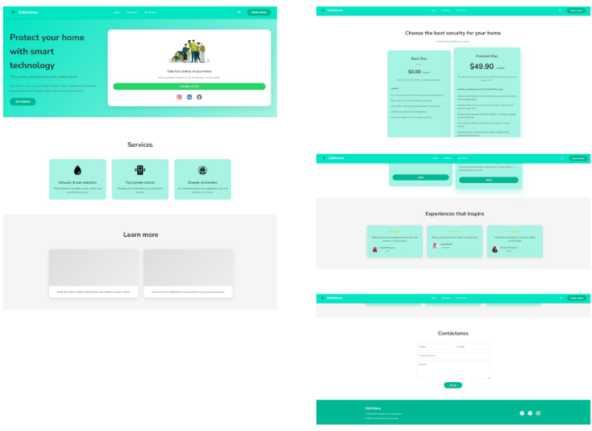

Branding
La identidad visual de SafeHome se construye a partir de un logotipo compuesto por un isotipo de casa con contorno circular y el nombre de la marca en una composición horizontal. Este recurso gráfico comunica de forma directa los conceptos de hogar, protección y monitoreo. El logotipo se utiliza como elemento principal de reconocimiento visual en pantallas de inicio, barras de navegación, formularios de acceso y secciones de presentación del servicio.
Para conservar consistencia visual, el sistema considera un uso uniforme del logo en relación con el espaciado. La unidad base tomada para márgenes y áreas de seguridad es la altura del ícono del logotipo. De este modo, se evita que otros elementos invadan su área visual y se garantiza una correcta legibilidad en diferentes tamaños de pantalla.

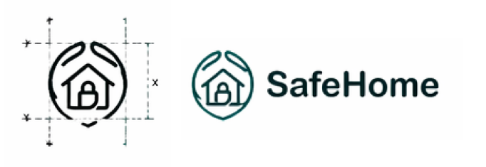

**Paleta de colores**
 
La paleta cromática de SafeHome se compone de cinco colores principales:
 
- `#A7F3E4` para fondos suaves y superficies secundarias.
- `#00E5C3` como color de acento y principal llamada visual.
- `#0D0D0D` para títulos, bloques destacados y contraste fuerte.
- `#6B7280` para texto secundario y elementos de apoyo.
- `#F5F5F5` para fondos neutros y separación visual de secciones.

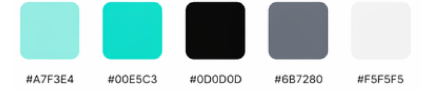

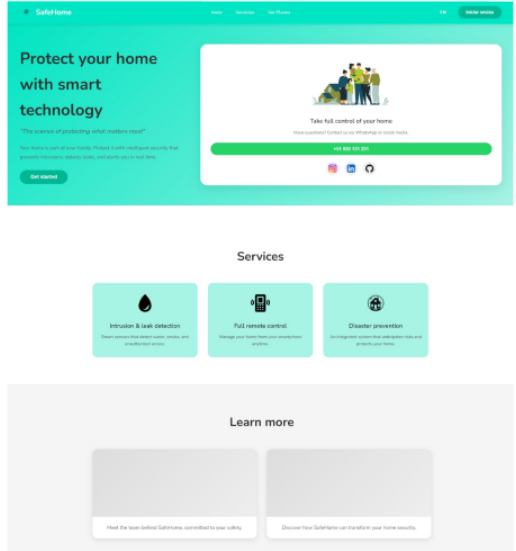

Esta selección responde a tres necesidades del producto. Primero, transmitir seguridad y limpieza visual mediante tonos claros y neutros. Segundo, destacar acciones relevantes usando un turquesa brillante como color primario de interacción. Tercero, asegurar contraste suficiente entre texto, botones y superficies, especialmente en pantallas donde se muestra información operativa del hogar.
 
**Tipografía**
 
La familia tipográfica seleccionada es Arial Rounded MT Bold. Esta tipografía se utiliza en títulos, botones y elementos principales de interfaz. Su elección responde a dos criterios: buena legibilidad en tamaños medianos y pequeños, y una forma visual amigable que reduce rigidez excesiva sin perder claridad.
 
La jerarquía tipográfica definida es la siguiente:
 
- H1: 36/44 px
- H2: 24/32 px
- H3: 18/26 px
- Texto destacado: 16/24 px
- Texto de párrafo: 14/20 px
- Texto pequeño o de ayuda: 12/16 px

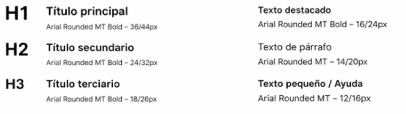

Esta jerarquía permite diferenciar correctamente títulos, subtítulos, bloques descriptivos y mensajes de apoyo. En la aplicación, esto facilita la lectura rápida de estados, servicios, planes y formularios.
 
**Espaciado**
 
El sistema de espaciado se basa en una retícula de múltiplos de **8 px**. Los valores establecidos son 8 px, 16 px, 24 px, 32 px, 48 px, 64 px, 80 px y 96 px. Esta decisión permite mantener alineación consistente entre bloques, separación uniforme entre componentes y una distribución visual predecible en resoluciones desktop y mobile.
 
El uso de una escala fija también facilita la construcción de layouts reutilizables. Por ejemplo, los espacios entre tarjetas, botones, grupos de texto y contenedores siguen una lógica repetible, lo cual simplifica el prototipado y la implementación posterior en desarrollo.
 
**Bordes, radios y sombras**
 
Para la geometría de la interfaz se definieron radios de borde de 4 px, 8 px, 12 px, 16 px, 24 px y 32 px. Esta escala permite adaptar el nivel de redondeo según el tipo de componente. Los campos de formulario, botones y tarjetas usan bordes redondeados para mantener coherencia con la tipografía y con la identidad visual general.
 
En cuanto a profundidad visual, se definieron tres niveles de sombra:
 
- Sombra S: 0 px 2 px 8 px rgba(0,0,0,0.06)
- Sombra M: 0 px 8 px 24 px rgba(0,0,0,0.08)
- Sombra L: 0 px 16 px 40 px rgba(0,0,0,0.12)

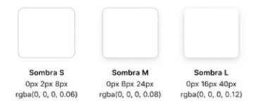

Estas sombras se utilizan de forma moderada en tarjetas, bloques destacados y elementos elevados. No se aplican de forma excesiva, ya que el sistema prioriza limpieza visual y lectura clara de contenido.
 
**Lenguaje visual e iconografía**
 
La iconografía del sistema utiliza íconos simples, lineales y de fácil reconocimiento. Entre ellos se incluyen referencias a hogar, seguridad, alertas, configuración, monitoreo y acciones de usuario. Este estilo evita ambigüedad visual y mantiene compatibilidad con el enfoque funcional de la plataforma.
 
A nivel gráfico, SafeHome utiliza una interfaz de baja saturación en fondos y alta claridad en elementos accionables. La combinación entre fondos claros, acentos turquesa y bloques negros destacados permite jerarquizar información sin recargar la pantalla.

**Tono de comunicación**
 
El tono de comunicación definido para SafeHome es **serio, claro, respetuoso y directo**. No se emplea un lenguaje irreverente ni decorativo. La redacción de botones, mensajes, estados y alertas usa frases breves y funcionales.
 
En la dimensión de estilo comunicacional, la propuesta se ubica así:
 
- Serio antes que divertido.
- Semiformal antes que casual.
- Respetuoso antes que irreverente.
- Sereno antes que entusiasta.
Este criterio es coherente con el tipo de producto, ya que SafeHome gestiona información relacionada con monitoreo del hogar, prevención y control. Por ello, la interfaz debe transmitir confianza operativa y no entretenimiento.
 
**Principios de diseño aplicados**
 
Los lineamientos generales del sistema se apoyan en los siguientes principios:
 
- Consistencia: mismo uso de colores, tipografía, iconos y componentes en todo el ecosistema.
- Claridad visual: jerarquía evidente entre títulos, contenido, acciones principales y estados del sistema.
- Legibilidad: tamaños tipográficos y contrastes adecuados para lectura rápida.
- Simplicidad funcional: reducción de elementos innecesarios y priorización de acciones concretas.
- Reconocimiento inmediato: uso estable del logo, la paleta y los patrones visuales en todas las pantallas.

### 4.1.2. Web Style Guidelines

Los Web Style Guidelines de SafeHome definen las reglas visuales y de interacción aplicadas a las interfaces web del Landing Page y de la Web Application. Estas reglas aseguran consistencia entre pantallas desktop y mobile, uniformidad en los componentes y una experiencia de uso predecible. Su aplicación se basa en la guía general de estilo ya definida, adaptándola al comportamiento específico de interfaces web responsive.

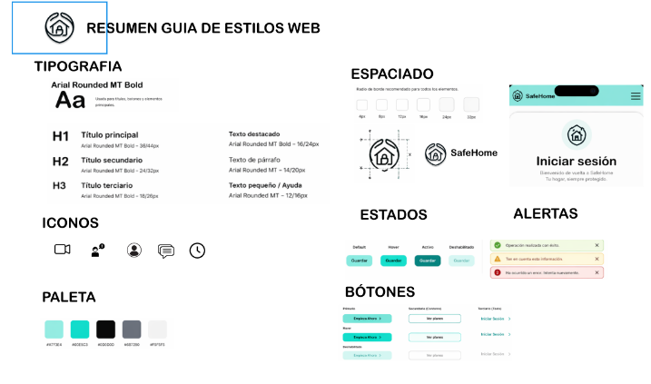

**Estructura visual para web**
 
La estructura de pantalla utiliza una organización por bloques claramente delimitados. En el Landing Page, la interfaz se divide en secciones horizontales de navegación, presentación principal, servicios, planes y acceso. En la Web Application, la estructura cambia a un esquema más funcional, con menú lateral o navegación fija y áreas de contenido principal.
 
En desktop, la distribución prioriza el uso de contenedores amplios, tarjetas alineadas y separación clara entre bloques informativos. En mobile, la estructura se reorganiza en una sola columna, manteniendo el mismo orden lógico del contenido, pero adaptando el tamaño de componentes, márgenes y jerarquías visuales.
 
**Diseño responsive**
 
La propuesta web de SafeHome sigue un enfoque responsive para garantizar adaptación a Desktop Web Browser y Mobile Web Browser. La interfaz mantiene la misma identidad visual en ambos formatos, pero ajusta la disposición de elementos según el ancho disponible.
 
Las principales reglas de adaptación son las siguientes:
 
- En desktop, los contenidos se muestran en varias columnas cuando el espacio lo permite.
- En mobile, los bloques se apilan verticalmente.
- Los botones principales mantienen jerarquía visual, pero reducen ancho y padding según pantalla.
- Las tarjetas conservan estructura, aunque cambian de disposición horizontal a vertical.
- La navegación superior simplifica la distribución de opciones en resoluciones pequeñas.
Esto permite que el usuario encuentre la misma información y complete las mismas tareas sin depender de un único tipo de dispositivo.

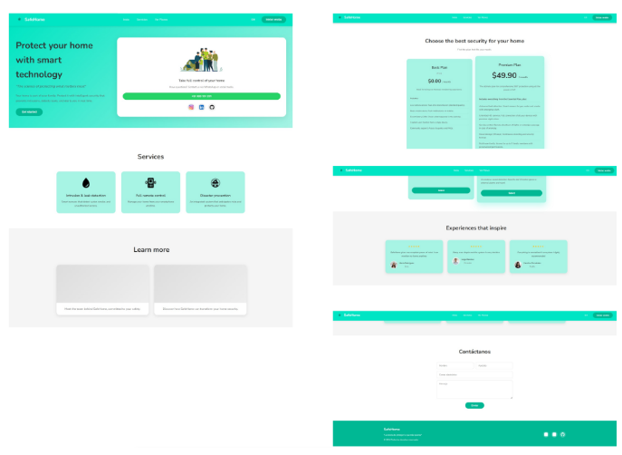

La navegación principal utiliza un menú visible y de acceso directo. En el Landing Page, las opciones identificadas son Inicio, Servicios, Ver planes e Iniciar sesión, acompañadas del logotipo como elemento de identidad central. Esta navegación se mantiene simple y con pocas opciones para evitar sobrecarga.
 
En la aplicación web, la navegación cambia a una estructura orientada a tareas. Se observa un menú lateral con accesos como Inicio, Cámaras, Dispositivos, Eventos, Alertas, Historial y Configuración. Esta decisión responde a un entorno con mayor volumen de información y acciones frecuentes.
 
Las reglas de navegación son:
 
- mantener visibles las acciones principales;
- usar etiquetas cortas y directas;
- ubicar opciones persistentes en zonas previsibles;
- evitar que el usuario dependa de memorizar rutas.

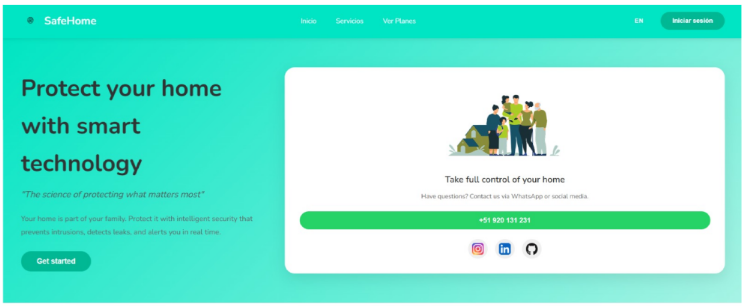

**Botones y llamadas a la acción**
 
La interfaz web define tres niveles de botones:
 
- Primario, para la acción principal de la pantalla;
- Secundario, para acciones complementarias;
- Terciario, para acciones de menor peso visual o navegación textual.
El botón primario usa el color turquesa como color de acción principal. El secundario emplea contorno con fondo claro. El terciario se presenta como texto con menor peso visual. Esta jerarquía facilita reconocer qué acción debe ejecutarse primero.
 
También se definen estados de interacción consistentes:
 
- Default
- Hover
- Activo
- Deshabilitado
En web, esto es importante porque el usuario espera retroalimentación visual al pasar el cursor, presionar o encontrar acciones no disponibles.

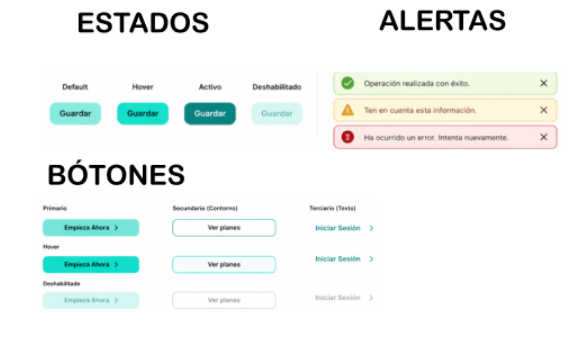

**Formularios y campos de entrada**
 
Los formularios utilizan componentes simples, con bordes redondeados y alto contraste respecto al fondo. Los tipos de campo identificados en la guía son:
 
- input por defecto;
- input con ícono;
- dropdown.
Las reglas aplicadas a formularios son:
 
- mostrar placeholder breve;
- mantener alineación uniforme entre campos;
- usar separación suficiente entre inputs;
- presentar botones de acción inmediatamente después del grupo de campos;
- evitar textos largos dentro del formulario.
En la pantalla de inicio de sesión, por ejemplo, se observa una estructura clara con campos de correo y contraseña, opción de recordar sesión y acceso a recuperación de contraseña. Esto responde a un patrón web estándar y fácil de reconocer.
 
**Tarjetas y contenedores**
 
Las tarjetas se usan como contenedores de información para servicios, planes, cámaras y accesos rápidos. Cada tarjeta presenta una jerarquía interna compuesta por título, contenido breve, ícono o imagen y acción asociada cuando corresponde.
 
Las reglas para tarjetas son:
 
- usar padding interno uniforme;
- separar visualmente título, descripción y acción;
- aplicar sombra ligera para distinguir el bloque del fondo;
- no saturar la tarjeta con demasiadas acciones;
- mantener consistencia de bordes y proporciones entre tarjetas del mismo tipo.
Este patrón se aplica tanto en el Landing Page como en el dashboard de la aplicación.
 
**Alertas y retroalimentación visual**
 
La guía define alertas con codificación por color y por ícono. Se distinguen al menos tres casos:
 
- operación exitosa;
- advertencia;
- error.
Estas alertas permiten comunicar el estado del sistema sin depender solo del texto. En entornos web, esta decisión mejora la detección rápida de eventos y reduce ambigüedad al ejecutar acciones como guardar, iniciar sesión o procesar información.
 
**Iconografía e imágenes**
 
La iconografía empleada es lineal, simple y consistente con el tema de seguridad doméstica. Se usa para representar funciones como monitoreo, control remoto, prevención, alertas y configuración. Los íconos no compiten visualmente con los títulos ni con las acciones principales.
 
Respecto a imágenes, la propuesta utiliza imágenes limpias y realistas. En el Landing Page se incluyen ilustraciones y fotografías relacionadas con el hogar y la vigilancia. Estas imágenes cumplen función de apoyo visual, no de contenido principal. Por ello, siempre se ubican subordinadas a la jerarquía funcional de la pantalla.

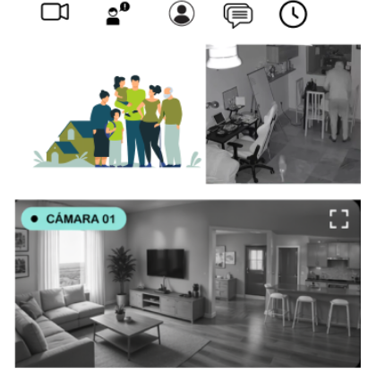

**Jerarquía de contenido en web**
 
La interfaz web de SafeHome utiliza una jerarquía visual clara basada en:
 
- tamaño tipográfico;
- contraste de color;
- uso de bloques oscuros para destacar secciones clave;
- separación mediante espacios en blanco;
- agrupación por tarjetas y contenedores.
En el Landing Page, la sección principal da prioridad al nombre del producto, propuesta de valor y botón principal. Luego se presentan servicios y planes. En la aplicación, la prioridad cambia hacia métricas del sistema, visualización de cámaras y accesos de control rápido.
 
**Criterios de interacción**
 
Los principales criterios de interacción definidos para la web son:
 
- las acciones primarias deben ser visibles sin esfuerzo;
- el usuario debe identificar fácilmente dónde hacer clic;
- cada estado interactivo debe tener respuesta visual;
- la navegación debe requerir el menor número de pasos posible;
- los elementos interactivos deben mantener tamaño suficiente para uso en pantallas táctiles y de escritorio.
Estos criterios son consistentes con un producto orientado a monitoreo y control del hogar, donde la rapidez de reconocimiento y la claridad operativa son prioritarias.
 
**Accesibilidad e inclusión en web**
 
La propuesta considera reglas básicas de diseño inclusivo aplicadas a la interfaz web:
 
- contraste suficiente entre fondo y texto;
- jerarquías tipográficas diferenciadas;
- botones con tamaño reconocible;
- etiquetas claras en navegación y formularios;
- distribución ordenada del contenido para reducir carga cognitiva.
Estas decisiones no modifican la estética del sistema, pero sí mejoran su uso por parte de personas con distintas condiciones de lectura, atención o acceso desde distintos dispositivos.

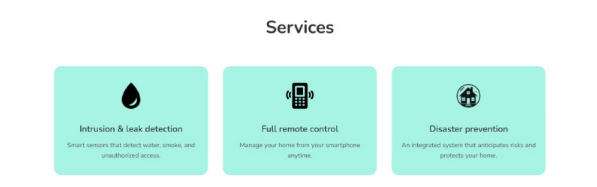

## 4.2. Information Architecture

### 4.2.1. Organization Systems

La arquitectura de información de SafeHome se organiza combinando sistemas de organización jerárquica, secuencial y, en algunos casos, cronológica o matricial, según el tipo de información y la tarea que el usuario necesita realizar. Esta decisión responde a la necesidad de ofrecer una experiencia clara tanto en la zona pública del producto como en la zona privada de monitoreo del hogar. SafeHome cuenta con una parte informativa orientada a los visitantes y una parte operativa enfocada en usuarios que administran dispositivos, revisan alertas y monitorean eventos de seguridad en tiempo real.
 
En la Landing Page se aplicará principalmente una organización jerárquica, ya que el contenido se mostrará de acuerdo con su nivel de importancia visual: primero la propuesta de valor, luego los beneficios del sistema, los servicios disponibles, la explicación de funcionamiento, los testimonios, las preguntas frecuentes y finalmente la información de contacto. Asimismo, en la sección "Cómo funciona" se empleará una organización secuencial, ya que el objetivo es explicar paso a paso cómo SafeHome monitorea el hogar y genera alertas. En esta zona pública, la información se categorizará por tópicos, separando claramente beneficios, servicios, testimonios, preguntas frecuentes y contacto. Adicionalmente, parte del contenido podrá presentarse según audiencia, considerando que el proyecto está dirigido a jóvenes adultos independientes, familias urbanas y propietarios de inmuebles en alquiler.
 
En el proceso de registro e inicio de sesión se utilizará una organización secuencial, ya que el usuario debe seguir un flujo ordenado para comenzar a usar la plataforma: acceder, registrarse o iniciar sesión e ingresar al sistema. Esta estructura paso a paso facilita la comprensión del recorrido inicial y reduce errores en el acceso.
 
Dentro de la aplicación web principal, la organización será mayormente jerárquica y por tópicos. El dashboard principal priorizará visualmente la información crítica, mostrando primero el estado general del hogar y las alertas más relevantes. A partir de este núcleo se agruparán los módulos en categorías funcionales, tales como dispositivos de seguridad, estado del hogar, alertas, eventos en tiempo real, historial, perfil/configuración y soporte. Esta categorización por tópicos permite que el usuario identifique rápidamente dónde realizar cada acción principal dentro del sistema.
 
En el módulo de eventos e historial se aplicará una categorización cronológica, ya que los incidentes de seguridad deben mostrarse en función de la fecha y hora en que ocurrieron. Además, estos eventos también podrán organizarse por tópicos, diferenciando el tipo de incidente detectado, como intrusión, humo, fuga de gas o anomalías en los servicios del hogar. En caso de presentarse mediante tablas o paneles comparativos, también podrá emplearse una organización matricial, relacionando variables como dispositivo, tipo de evento, estado y momento de ocurrencia.
 
[https://www.figma.com/board/ekvGCZkbyE4cyCkpUJp4BR/Untitled?node-id=0-1&t=TtPDIWI59f4syduq-1](https://www.figma.com/board/ekvGCZkbyE4cyCkpUJp4BR/Untitled?node-id=0-1&t=TtPDIWI59f4syduq-1)

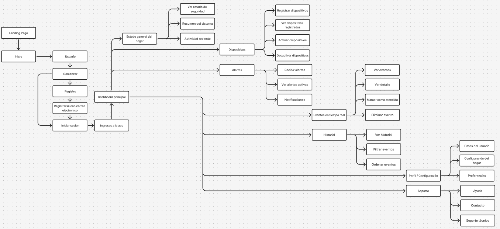

### 4.2.2. Labeling Systems

Contenido de la sección.

### 4.2.3. SEO Tags and Meta Tags

Contenido de la sección.

### 4.2.4. Searching Systems

Contenido de la sección.

### 4.2.5. Navigation Systems

Contenido de la sección.

## 4.3. Landing Page UI Design

Contenido de la sección.

### 4.3.1. Landing Page Wireframe

Contenido de la sección.

### 4.3.2. Landing Page Mock-up

Contenido de la sección.

## 4.4. Web Applications UX/UI Design

Contenido de la sección.

### 4.4.1. Web Applications Wireframes

Contenido de la sección.

### 4.4.2. Web Applications Wireflow Diagrams

Contenido de la sección.

### 4.4.3. Web Applications Mock-ups

Contenido de la sección.

### 4.4.4. Web Applications User Flow Diagrams

Contenido de la sección.

## 4.5. Web Applications Prototyping

Contenido de la sección.

## 4.6. Domain-Driven Software Architecture

Contenido de la sección.

### 4.6.1. Design-Level Event Storming

Contenido de la sección.

### 4.6.2. Software Architecture Context Diagram

Contenido de la sección.

### 4.6.3. Software Architecture Container Diagrams

Contenido de la sección.

### 4.6.4. Software Architecture Components Diagrams

Contenido de la sección.

## 4.7. Software Object-Oriented Design

Contenido de la sección.

### 4.7.1. Class Diagrams

Contenido de la sección.

## 4.8. Database Design

Contenido de la sección.

### 4.8.1. Database Diagrams

Contenido de la sección.

---

# Capítulo V: Product Implementation, Validation & Deployment

## 5.1. Software Configuration Management

Contenido de la sección.

### 5.1.1. Software Development Environment Configuration

Contenido de la sección.

### 5.1.2. Source Code Management

Contenido de la sección.

### 5.1.3. Source Code Style Guide & Conventions

Contenido de la sección.

### 5.1.4. Software Deployment Configuration

Contenido de la sección.

## 5.2. Landing Page, Services & Applications Implementation

Contenido de la sección.

### 5.2.1. Sprint 1

Contenido de la sección.

#### 5.2.1.1. Sprint Planning 1

Contenido de la sección.

#### 5.2.1.2. Aspect Leaders and Collaborators

Contenido de la sección.

#### 5.2.1.3. Sprint Backlog 1

Contenido de la sección.

#### 5.2.1.4. Development Evidence for Sprint Review

Contenido de la sección.

#### 5.2.1.5. Execution Evidence for Sprint Review

Contenido de la sección.

#### 5.2.1.6. Services Documentation Evidence for Sprint Review

Contenido de la sección.

#### 5.2.1.7. Software Deployment Evidence for Sprint Review

Contenido de la sección.

#### 5.2.1.8. Team Collaboration Insights during Sprint

Contenido de la sección.

---

# Conclusiones

Contenido de conclusiones.

---

# Bibliografía

Contenido de bibliografía en formato APA 7.

---

# Anexos

Contenido de anexos.
